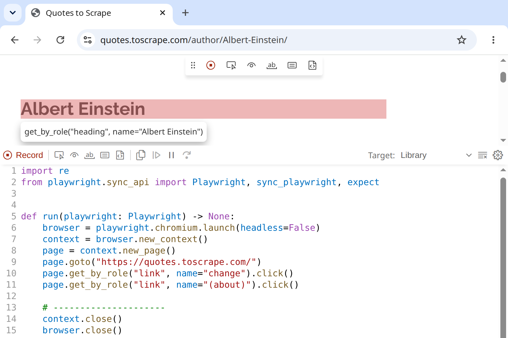

# Dynamic Web Pages with Selenium {#sec-dynamic-pages}

::: {.callout-tip}
## Learning Objectives
- Explain why JavaScript-rendered content is invisible to `requests` + BeautifulSoup
- Decide by hand — with View Source, JavaScript switched off, and the Network tab — whether a page needs a browser at all
- Install Selenium, check what Selenium Manager finds and downloads before starting the first browser, and fix it when it fails
- Start Firefox, Edge, or Safari instead of Chrome, and say what each one needs
- Locate elements using multiple strategies (ID, name, XPath, CSS selector)
- Simulate user interactions — clicking, typing, and scrolling — programmatically
- Pass fully-rendered page source from Selenium back to BeautifulSoup for parsing
- Script the same tasks with Playwright from the terminal, and explain why its simple API does not run in a notebook
- Compare three ways to hand browser scripting to tools — an AI agent that drives the browser, an agent that writes the scraper, and Playwright's recorder — and weigh their costs and risks
- Assess the fragility and ethical implications of browser automation
:::

::: {.callout-tip}
## Companion Notebook
Run this chapter's code as you read: open the [companion notebook](https://github.com/cuinfoscience/Web-Data-Science-Book/blob/main/notebooks/ch-08-dynamic-pages.ipynb) (see @sec-appendix-notebooks for all of them).
:::


## When Static Scraping Fails

In @sec-static-pages, you learned to retrieve web pages with `requests` and parse them with BeautifulSoup. This works well for pages whose content is fully present in the initial HTML — what we call *static* pages. That chapter ended on a page where it failed: IMDb answered `requests.get()` for *The Godfather* with status 202 and zero characters of HTML, while a browser showed the whole page. Most modern websites are *dynamic*: their content is loaded, modified, or entirely rendered by JavaScript after the initial HTML arrives.

When you use `requests.get()` on a dynamic page, you get the HTML skeleton before JavaScript has run. The data you see in your browser may simply not exist in the response that `requests` receives. You can verify this by comparing `requests.get(url).text` with what you see in the browser — if significant content is missing from the `requests` version, the page is dynamic.

The solution is a tool that can execute JavaScript: a real web browser, controlled programmatically. This chapter teaches two. Selenium, the long-standing standard, runs in your notebook; Playwright, a newer tool, runs as a script from the terminal. First, though, check whether you need a browser at all.

## Do You Need a Browser?

Driving a browser is slow and fragile, so check by hand first. Three checks in your own browser settle the question for most pages, and each takes about a minute. The examples use [Quotes to Scrape](https://quotes.toscrape.com), part of a [web scraping sandbox](https://toscrape.com) built for practice: it serves the same quotes in several ways, each one, in the sandbox's words, "including new scraping challenges for you."

### Check 1: View Source

Open <https://quotes.toscrape.com/js/>. Ten quotes appear on the screen, yet `requests` finds none of them:

```{python}
import requests
from bs4 import BeautifulSoup

HEADERS = {"User-Agent": "WebDataScience/1.0 (INFO 4617; you@colorado.edu)"}

response = requests.get("https://quotes.toscrape.com/js/", headers=HEADERS)
soup = BeautifulSoup(response.text, "html.parser")
print(len(soup.select("div.quote")))
# 0
```

Right-click the page and choose **View Page Source** to see exactly what the server sent (@fig-view-source). There is no `<div class="quote">` anywhere in it. The quotes are in the file all the same: a `<script>` near the bottom holds them as a JavaScript array named `data`, and the page's own code turns that array into the boxes you see.

{#fig-view-source .lightbox fig-alt="Screenshot of Chrome's View Source for quotes.toscrape.com/js/, lines 11 to 43. The body opens with a header holding the site title, Quotes to Scrape, and a Login link. Then a script tag loads jquery.js, and a second script begins var data = [ followed by a quote object: tags change, deep-thoughts, thinking, and world; an author object for Albert Einstein; and the text of his quote, wrapped onto a second line."}

Data inside a script is still data your `requests` response already contains. A regular expression can cut the array out, and because it is written in JSON syntax, `json.loads()` (@sec-data-formats) can parse it:

```{python}
import json
import re

# The array sits between "var data = " and the next "];" -- capture it, brackets included
match = re.search(r"var data = (\[.*?\]);", response.text, re.DOTALL)
quotes = json.loads(match.group(1))
print(len(quotes), quotes[0]["author"]["name"])
# 10 Albert Einstein
```

### Check 2: Turn JavaScript Off

A page with its JavaScript switched off shows roughly what `requests` has to work with. In Chrome's developer tools, open the **Command Menu** (Control+Shift+P on Windows and Linux, Command+Shift+P on a Mac), type `javascript`, choose **Disable JavaScript**, and reload the page. @fig-js-off-on shows the result on the quotes page: the title, the login link, and a **Next** button, but no quotes. JavaScript stays off in that tab only while developer tools are open; close them, or run **Enable JavaScript**, to turn it back on. Firefox and Safari have the same switch in their developer settings.

{#fig-js-off-on .lightbox fig-alt="Two screenshots side by side of the Quotes to Scrape page in a narrow window. On the left, labeled JavaScript off, the page shows only its title, a Login link, a Next button, and the footer, with empty space where the quotes would be. On the right, labeled JavaScript on, the same page shows quote boxes by Albert Einstein and J.K. Rowling, each with its tags."}

### Check 3: Watch the Network Tab

Now open <https://quotes.toscrape.com/scroll>. View Source shows no quotes and no data array this time, only scripts. Open the **Network** tab (@sec-protocols), click the **Fetch/XHR** filter, and scroll down the page. Each time you near the bottom, a new request appears: `quotes?page=2`, then `quotes?page=3`. Click one and open **Preview** (@fig-network-json). The response is JSON: ten quotes at a time, plus a `has_next` flag that says whether another page exists.

{#fig-network-json .lightbox fig-alt="Screenshot of Chrome's developer tools with the Network tab filtered to Fetch/XHR. The request list shows four requests, quotes?page=1 through quotes?page=4, with page 2 selected. Its Preview pane shows JSON with has_next true, page 2, and a quotes array open to its first item, whose fields are author, tags, and text, followed by tag null and top_ten_tags."}

That request is an interface the page built for itself, and your own code can call it too. Check the site's terms first (@sec-ethics), then request it directly, with a pause between pages:

```{python}
import time

all_quotes = []
page = 1
while True:
    data = requests.get(
        "https://quotes.toscrape.com/api/quotes",
        params={"page": page},
        headers=HEADERS,
    ).json()
    all_quotes.extend(data["quotes"])
    if not data["has_next"]:  # The API says when to stop
        break
    page += 1
    time.sleep(1)

print(len(all_quotes))
# 100
```

The JSON arrives already structured, with no HTML to parse. Nobody promised to keep an undocumented endpoint like this one stable, though, so save what you collect as you go, as @sec-archives recommends.

When all three checks come up empty — the data appears only after the page runs code you cannot reproduce, or only after clicks, typing, or scrolling you must perform — you need a browser. The rest of this chapter drives one in two ways: with Selenium in the notebook, and then with Playwright as a script. The Selenium examples start on simple pages like xkcd that do not strictly need a browser, because simple pages make the tool's basics easy to see.

## Setting Up Selenium

Selenium requires two components: the `selenium` Python library and a browser driver — a small program that lets Python control a specific browser. You only need to install the library: since version 4.6 (late 2022), Selenium has shipped with **Selenium Manager**, which finds or downloads the correct driver for whatever browser you have installed, and downloads the browser as well if you have none.

```{python}
# Install from a terminal:
# pip install selenium
```

### Before the First Browser

Creating a driver takes one line, `webdriver.Chrome()`, and that line does three jobs before a window appears. It reads your settings; it runs Selenium Manager, which finds your browser and downloads whatever is missing; and it starts the driver and the browser. When the line fails, the error rarely says which job went wrong. So do the first two jobs yourself, one cell at a time, and check the result before you start the browser.

The first run downloads files. The driver is about 10 MB. On a machine without Chrome, Selenium Manager also downloads **Chrome for Testing**, a build of Chrome made for automation, at about 190 MB. A download that size can take minutes on busy Wi-Fi, and in a cell of its own it can't be mistaken for a frozen scraper.

**Step 1: settings first.** Selenium Manager takes its settings from environment variables and reads them each time it runs, so set them before anything starts it:

```{python}
import os

import selenium

print("selenium", selenium.__version__)  # the next cell needs 4.20 or later

os.environ["SE_SKIP_DRIVER_IN_PATH"] = "true"  # ignore stray drivers on your PATH
os.environ["SE_AVOID_STATS"] = "true"          # send no usage statistics (optional)
# os.environ["SE_PROXY"] = "http://proxy.example.edu:3128"  # only behind a proxy
```

If the version printed is older than 4.20 (April 2024), run `pip install --upgrade selenium` and restart the notebook's kernel. The first setting matters most: it tells Selenium Manager to ignore any driver already on your system `PATH` and use one it has matched to your browser. The end of this section shows what happens without it. The second setting stops the usage statistics that Selenium Manager otherwise sends. The third is for networks that require a proxy; "When Selenium Manager Fails" below says when you need it.

**Step 2: run Selenium Manager.** Ask it for the driver and browser that `webdriver.Chrome()` would use, with its log turned on so that you can read each decision:

```{python}
import logging

from selenium.webdriver.common.selenium_manager import SeleniumManager

logging.basicConfig(level=logging.WARNING, format="%(levelname)s %(message)s")
log = logging.getLogger("selenium.webdriver.common.selenium_manager")

log.setLevel(logging.DEBUG)    # show each decision Selenium Manager makes
paths = SeleniumManager().binary_paths(["--browser", "chrome"])
log.setLevel(logging.WARNING)  # from here on, show only its warnings
```

On a Linux machine with no Chrome, in September 2026, the first run printed these lines, among others (the home folder is shortened to `~`):

```
DEBUG Found chromedriver 147.0.7727.24 in PATH: /opt/node22/bin/chromedriver
DEBUG chrome not found in the system
DEBUG Required browser: chrome 154.0.8037.57
DEBUG Downloading chrome 154.0.8037.57 from https://storage.googleapis.com/chrome-for-testing-public/...
DEBUG Required driver: chromedriver 154.0.8037.57
DEBUG Skipping chromedriver in path: /opt/node22/bin/chromedriver
DEBUG Downloading chromedriver 154.0.8037.57 from https://storage.googleapis.com/chrome-for-testing-public/...
DEBUG Driver path: ~/.cache/selenium/chromedriver/linux64/154.0.8037.57/chromedriver
DEBUG Browser path: ~/.cache/selenium/chrome/linux64/154.0.8037.57/chrome
```

Read it from the top. Selenium Manager found an old driver on the machine's `PATH`, left there by an npm package. It found no Chrome, so it downloaded Chrome for Testing 154 and the driver made for it, and it skipped the old driver because of the first setting. Both went into its cache folder, `~/.cache/selenium` (`%USERPROFILE%\.cache\selenium` on Windows), where the next run finds them without downloading anything. On a machine with Chrome installed, the log says `Detected browser: chrome` and the version instead, and only the driver is downloaded.

**Step 3: check before you start the browser.** Look at the two paths Selenium Manager returned:

```{python}
from pathlib import Path

driver_path = Path(paths["driver_path"])
browser_path = Path(paths["browser_path"])
cache = Path.home() / ".cache" / "selenium"

print("Driver: ", driver_path, "(found)" if driver_path.is_file() else "(MISSING)")
print("Browser:", browser_path, "(found)" if browser_path.is_file() else "(MISSING)")
print("Driver chosen by Selenium Manager:", cache in driver_path.parents)
```

On the same machine, it printed:

```
Driver:  ~/.cache/selenium/chromedriver/linux64/154.0.8037.57/chromedriver (found)
Browser: ~/.cache/selenium/chrome/linux64/154.0.8037.57/chrome (found)
Driver chosen by Selenium Manager: True
```

Start the browser only when three things are true:

- Both paths end in `(found)`.
- The last line says `True`. Selenium Manager keeps the drivers it matches to your browser in its cache; a driver anywhere else came from your `PATH`, and nothing has checked that it fits your browser.
- The log from step 2 has no line starting with `WARNING`. Selenium Manager warns instead of stopping when something looks wrong, so a warning now can become an error when the browser starts.

If step 2 stopped with an error instead, Selenium Manager could not find or download something. The message says what, and "When Selenium Manager Fails" below lists the usual causes.

Without the first setting, the same machine went wrong, and steps 2 and 3 caught it before the browser started. Selenium Manager downloaded Chrome 154 and worked out that it needed driver 154, then returned the old driver 147 from the `PATH` anyway, because a driver on your `PATH` wins. The log warned that "it is advised to delete the driver in PATH and retry," step 3 printed `False`, and `webdriver.Chrome()` failed with `This version of ChromeDriver only supports Chrome version 147`.

### Starting the Browser

Now create the driver:

```{python}
from selenium import webdriver

driver = webdriver.Chrome()

# The browser that opened, and the driver controlling it
print("Browser:", driver.capabilities["browserVersion"])
print("Driver: ", driver.capabilities["chrome"]["chromedriverVersion"].split()[0])
```

It printed:

```
Browser: 154.0.8037.57
Driver:  154.0.8037.57
```

`webdriver.Chrome()` runs Selenium Manager once more, finds what step 2 downloaded in its cache, and starts the pair that step 3 checked. The two numbers should match up to the first dot. A browser window opens (@fig-selenium-cft). This is your programmable browser — every command you issue through the `driver` object happens in that window.

{#fig-selenium-cft .lightbox fig-alt="Screenshot of a Chrome for Testing window showing the xkcd home page and the comic Voyager Instruments. A bar under the address bar begins Chrome for Testing v154.0.8037.57 is only for automated testing, and offers a Download Chrome link."}

### What Selenium Manager Does

Selenium Manager is a small program that ships inside the `selenium` package. Step 2 ran it on its own; `webdriver.Chrome()` runs it every time, before the browser starts. It:

1. Looks for a `chromedriver` already on your system `PATH`, and for Chrome itself.
2. Asks Google's Chrome for Testing service which driver version matches your Chrome. If you have no Chrome at all, it downloads Chrome for Testing as well.
3. Downloads the matching driver, and keeps it and any browser it fetched in a cache folder: `~/.cache/selenium` on macOS and Linux, `%USERPROFILE%\.cache\selenium` on Windows.
4. Reuses the cache next time, checking for newer versions at most once an hour.

It also sends anonymous usage statistics (the browser, operating system, language, and Selenium version) to Plausible, a web analytics service, unless you set `SE_AVOID_STATS=true`, as step 1 does.

### When Selenium Manager Fails

- **`This version of ChromeDriver only supports Chrome version N`.** An old driver on your `PATH`, left by a manual download, Homebrew, conda, or an npm package, outranks the one Selenium Manager would choose. Set `SE_SKIP_DRIVER_IN_PATH=true`, as step 1 does, or delete the old driver.
- **Downloads fail on a campus or corporate network.** A proxy or firewall may block Google's download servers. Set `SE_PROXY` to your proxy's address, or run once on an open network; after that, Selenium Manager works from its cache, and `SE_OFFLINE=true` stops it from trying the network at all.
- **Chrome is installed somewhere unusual.** Browsers installed through conda or snap can hide from Selenium Manager. Give it the path: in step 2, add `"--browser-path", "/path/to/chrome"` to the list, and when you start the browser, set `options.binary_location = "/path/to/chrome"`.
- **Something is stuck in the cache.** Delete the cache folder listed above and run your code again; Selenium Manager rebuilds it.
- **`'SeleniumManager' object has no attribute 'binary_paths'`.** Your `selenium` is older than 4.20. Run `pip install --upgrade selenium` and restart the kernel.
- **Your computer runs Linux on an ARM processor, such as a Raspberry Pi.** Selenium's documentation says Selenium Manager doesn't run there, but Selenium 4.49 includes a build for 64-bit ARM, and Chrome for Testing and Firefox both publish 64-bit ARM Linux builds for it to download. If it fails anyway, or on 32-bit Linux such as 32-bit Raspberry Pi OS, where there is no Selenium Manager at all, install the browser and its driver with your system's package manager.

Each fix is a setting or a file to delete. Put the setting in step 1's cell, then run steps 1 to 3 again: they show whether the fix worked before you start a browser.

### Other Browsers

This chapter uses Chrome, but Selenium drives the other major browsers the same way. Once a driver has started, `driver.get()`, `find_element()`, and the waits later in this chapter work unchanged. What differs is how each browser starts: its driver, who makes that driver, and what Selenium Manager can download for you.

| Browser | Start it with | Its driver, made by | Selenium Manager downloads |
|---|---|---|---|
| Chrome | `webdriver.Chrome()` | chromedriver, Google | the driver, and Chrome for Testing if you have no Chrome |
| Firefox | `webdriver.Firefox()` | geckodriver, Mozilla | the driver, and Firefox if you have none |
| Edge | `webdriver.Edge()` | msedgedriver, Microsoft | the driver, and Edge if you have none (on Windows, which comes with Edge, only with administrator rights) |
| Safari | `webdriver.Safari()` | safaridriver, Apple | nothing: macOS includes both |

Steps 1 to 3 work for Firefox and Edge too: in step 2, change `"chrome"` to `"firefox"` or `"edge"`.

**Firefox.** Start it in place of Chrome. Its capabilities report the driver's version under a name of its own:

```python
driver = webdriver.Firefox()

print("Browser:", driver.capabilities["browserVersion"])
print("Driver: ", driver.capabilities["moz:geckodriverVersion"])
```

In September 2026 that printed Firefox `156.0.1` and geckodriver `0.37.1`. The numbers don't match, and they shouldn't: geckodriver has its own version numbers, and each release supports a range of Firefox versions. Selenium Manager's log lists the ones that fit your Firefox (`Valid geckodriver versions for firefox 156: ["0.37.1", ...]`) and picks the newest. Firefox's headless switch differs too: `options.add_argument("-headless")`, with one dash, on `webdriver.FirefoxOptions()`. And geckodriver downloads come from GitHub, so a network that blocks GitHub blocks Firefox's driver even when Chrome's downloads work.

On Ubuntu 22.04 and later, the Firefox that comes with the system is a snap, a package that runs in a container with its own view of the files, and a driver outside the container can leave it hanging at startup. Mozilla's fix is to use the driver that comes inside the snap:

```python
service = webdriver.FirefoxService(executable_path="/snap/bin/geckodriver")
driver = webdriver.Firefox(service=service)
```

**Edge.** Microsoft builds Edge on Chromium, the open-source core of Chrome, so Edge takes the same options as Chrome: create them with `webdriver.EdgeOptions()`, and `--headless=new` and the other flags in "Headless Mode" below work unchanged.

```python
driver = webdriver.Edge()

print("Browser:", driver.capabilities["browserVersion"])
print("Driver: ", driver.capabilities["msedge"]["msedgedriverVersion"].split()[0])
```

As with Chrome, the two numbers match: `153.0.4234.48` for both in September 2026.

**Safari.** Safari's driver comes only with macOS, at `/usr/bin/safaridriver`, so Selenium Manager downloads nothing for it, and on Windows or Linux `webdriver.Safari()` fails with `Unable to obtain driver for safari`. On a Mac, turn on remote automation once, in Terminal (if macOS refuses, run it again with `sudo` in front):

```
safaridriver --enable
```

Then start it:

```python
driver = webdriver.Safari()
```

Safari's automation differs from the others' in ways you will notice:

- It runs in separate windows with an orange address bar. Like a private window, each session starts from a clean slate: it can't see your browsing history or AutoFill data.
- A transparent "glass pane" covers the window while your code runs, so stray clicks and keystrokes can't interfere. You can break through it to stop a stuck script, but that ends the session for good; the window stays open until you close it.
- Only one Safari session can run at a time, so two notebooks can't both drive Safari.
- Safari has no headless mode: every session opens a window.

Playwright, later in this chapter, offers another route to Safari's engine. It installs its own build of WebKit, the engine inside Safari, with `playwright install webkit`, and that build runs on Windows and Linux as well as macOS. It is not Safari itself, and Playwright's documentation recommends running it on a Mac for the closest match.

## Navigating and Finding Elements

```{python}
# Navigate to a website
driver.get("https://xkcd.com")

# Find elements by various strategies
from selenium.webdriver.common.by import By

# By ID
comic_div = driver.find_element(By.ID, "comic")

# By CSS selector
nav_links = driver.find_elements(By.CSS_SELECTOR, "ul.comicNav li a")

# By XPath
title = driver.find_element(By.XPATH, "//div[@id='ctitle']")
print(title.text)  # The title of the current comic
```

The `find_element` method (singular) returns the first matching element. The `find_elements` method (plural) returns a list of all matches.

## Extracting Data

xkcd is famous for its hidden alt-text messages. Right-click the comic and choose **Inspect**, and developer tools show where they live (@fig-xkcd-inspect): the `` tag's `alt` attribute holds the comic's name, and its `title` attribute holds the hover joke that readers call the alt-text.

{#fig-xkcd-inspect .lightbox fig-alt="Screenshot of the Elements panel of Chrome's developer tools on xkcd.com. Inside div id comic, the comic's img element is selected. Its src points to imgs.xkcd.com, its title attribute reads Convincing him to turn off the stupid laser show and useless sound system was such a huge ordeal that no one has wanted to do it again, and its alt attribute is Voyager Instruments."}

You can extract both attributes:

```{python}
# Find the comic image
img = driver.find_element(By.XPATH, "//div[@id='comic']//img")

# Get the alt-text and title attributes
print(f"Alt text: {img.get_attribute('alt')}")
print(f"Title (hover text): {img.get_attribute('title')}")
```

## Simulating Interactions

Selenium can simulate clicks, keyboard input, and scrolling — anything a human user would do:

### Clicking

```{python}
# Click the "Random" button to navigate to a random comic
random_button = driver.find_element(By.XPATH, "//ul[@class='comicNav']//a[contains(text(),'Random')]")
random_button.click()

# Extract the alt-text from the random page
import time
time.sleep(1)  # Wait for the page to load

img = driver.find_element(By.XPATH, "//div[@id='comic']//img")
print(f"Random comic title: {img.get_attribute('title')}")
```

### Typing and Searching

Selenium can type into forms and submit them. We will demonstrate with Wikipedia's search box: Wikipedia's robots policy is permissive toward automated access, and its markup is stable enough that this example should keep working for years. (Search engines like Google, by contrast, explicitly prohibit automated queries in their Terms of Service — where you point your automation matters as much as how you write it.)

```{python}
from selenium.webdriver.common.keys import Keys

# Navigate to the Wikipedia portal
driver.get("https://www.wikipedia.org")

# Find the search box by its name attribute
search_box = driver.find_element(By.NAME, "search")

# Type a query
search_box.send_keys("Colorado Buffaloes")
time.sleep(1)  # Observe autocomplete suggestions

# Press Enter to submit the search
search_box.send_keys(Keys.RETURN)
time.sleep(2)  # Wait for the results page to load

# Read the resulting page
print(driver.title)
# Colorado Buffaloes - Wikipedia

heading = driver.find_element(By.ID, "firstHeading")
print(heading.text)
# Colorado Buffaloes
```

When your query matches an article title exactly, Wikipedia takes you straight to that article; otherwise you land on a search results page listing candidate matches. Either way, the pattern is the one you will reuse on any site with a search form: find the input element, type with `send_keys()`, submit with `Keys.RETURN`, wait for the new page, and read the results.

::: {.callout-warning}
## Automation Is Not a Loophole
Everything from @sec-ethics applies with full force to browser automation. A robots.txt disallow rule does not stop mattering because a real browser is doing the requesting, and a site's Terms of Service does not stop applying because a script is doing the clicking. Legal risk concentrates precisely where Selenium is most tempting: automating logged-in accounts and ToS-restricted content. Check the policies of any site before you automate interactions with it.
:::

### Scrolling

Some pages load content as you scroll (infinite scroll). You can simulate this:

```{python}
from selenium.webdriver.common.keys import Keys

body = driver.find_element(By.TAG_NAME, "body")

# Scroll down 5 times
for i in range(5):
    body.send_keys(Keys.PAGE_DOWN)
    time.sleep(1)  # Wait for new content to load
```

### Waiting for Dynamic Content

The `time.sleep()` calls in the examples above are a crude approach to waiting for content to load. A better strategy is *explicit waits*, which pause execution until a specific condition is met:

```{python}
from selenium.webdriver.support.ui import WebDriverWait
from selenium.webdriver.support import expected_conditions as EC

# This practice page waits ten seconds before its JavaScript adds the quotes
driver.get("https://quotes.toscrape.com/js-delayed/")

# Wait up to 15 seconds for the first quote to appear
element = WebDriverWait(driver, 15).until(
    EC.presence_of_element_located((By.CLASS_NAME, "quote"))
)
print(len(driver.find_elements(By.CLASS_NAME, "quote")))
# 10
```

A `time.sleep(2)` here would have looked at the page too early and found nothing. `WebDriverWait` returned after about ten seconds, the moment the first quote appeared.

`WebDriverWait` checks the condition repeatedly (every 0.5 seconds by default) and returns the element as soon as it appears, or raises a `TimeoutException` if the timeout expires. This is superior to `time.sleep()` in two ways: it does not wait longer than necessary (if the element appears in 0.2 seconds, it proceeds immediately), and it fails loudly if the element never appears (rather than silently returning an empty page).

The most common expected conditions you will use are:

- `presence_of_element_located` — the element exists in the DOM (even if not visible)
- `visibility_of_element_located` — the element is both present and visible on the page
- `element_to_be_clickable` — the element is visible, enabled, and can receive clicks
- `text_to_be_present_in_element` — specific text has appeared inside an element

Use these instead of `time.sleep()` whenever possible. The combination of `WebDriverWait` with explicit conditions makes your Selenium scripts both more reliable (they wait for exactly what they need) and faster (they proceed as soon as the condition is met rather than waiting a fixed duration). You will see this pattern used in the practical workflow section later in this chapter.

### Scraping Infinite Scroll Pages

Many modern websites load content progressively as you scroll — social media feeds, image galleries, and product listings all use this pattern. The technique for scraping these pages involves scrolling to the bottom, waiting for new content to load, and repeating until no more content appears:

```{python}
def scrape_infinite_scroll(driver, max_scrolls=20, scroll_pause=2):
    """Scroll an infinite-scroll page and collect all loaded content."""
    last_height = driver.execute_script("return document.body.scrollHeight")

    for i in range(max_scrolls):
        # Scroll to the bottom of the page
        driver.execute_script("window.scrollTo(0, document.body.scrollHeight);")
        time.sleep(scroll_pause)

        # Check if the page grew
        new_height = driver.execute_script("return document.body.scrollHeight")
        if new_height == last_height:
            print(f"No new content after scroll {i+1}. Stopping.")
            break
        last_height = new_height
        print(f"Scroll {i+1}: page height grew to {new_height}px")

    # Return the fully-loaded page source
    return driver.page_source
```

The key insight is checking `document.body.scrollHeight` before and after each scroll. When the height stops growing, you have reached the end of the available content. Some sites use a "Load More" button instead of infinite scroll — for those, replace the scroll with a click on the button and watch for the button to disappear or become disabled.

On <https://quotes.toscrape.com/scroll>, this function stops after its tenth scroll with all 100 quotes loaded. It is also a page where you do not need it: the Network tab check at the start of this chapter found the JSON the scrolling requests, and `requests` collected the same 100 quotes with no browser at all.

A practical consideration: infinite scroll pages can contain thousands of items, and loading them all consumes significant memory in the browser process. Set a reasonable `max_scrolls` limit based on how much data you actually need. If you are collecting data for a class project, you rarely need more than a few hundred items — scrolling through an entire social media feed of 10,000 posts is both unnecessary and discourteous to the server. Remember the proportionality principle from @sec-ethics: collect only the data you need for your research question.

## Passing to BeautifulSoup

Once the page is fully rendered in the browser, you can extract the complete HTML and parse it with the familiar BeautifulSoup tools:

```{python}
from bs4 import BeautifulSoup

# Get the fully-rendered page source from Selenium
html = driver.page_source
soup = BeautifulSoup(html, "html.parser")

# Now use BeautifulSoup as usual
links = soup.find_all("a", href=True)
print(f"Total links on page: {len(links)}")
```

This hybrid approach — Selenium for rendering, BeautifulSoup for parsing — gives you the best of both worlds. Selenium excels at navigating, clicking, scrolling, and waiting for JavaScript to execute. BeautifulSoup excels at searching and extracting data from HTML. By combining them, you avoid the awkwardness of using Selenium's relatively limited element-finding API for complex extraction tasks while still getting access to the fully-rendered page content.

The workflow is always the same: use Selenium to get the page into the state you need (scrolled, clicked, searched, logged in), then hand off the rendered HTML to BeautifulSoup for extraction. Think of Selenium as the hands that navigate the browser and BeautifulSoup as the eyes that read the content. This division of labor keeps your code cleaner and more maintainable than trying to do everything with Selenium alone.

## Always Close the Driver

When you are done, close the browser window:

```{python}
driver.quit()
```

After calling `quit()`, any subsequent calls to the driver will raise an error. Use `try/finally` blocks to ensure cleanup:

```{python}
try:
    driver.get("https://example.com")
    # ... scraping logic ...
finally:
    driver.quit()
```

## The Fragility Problem

::: {.callout-warning}
## Warning
Screen-scraping with Selenium is inherently fragile. The Twitter scraping examples that worked in the 2019 version of this course broke completely by 2024 because Twitter (now X) redesigned its HTML to use dynamically-generated class names and require authentication for basic browsing. This is not unusual — platforms regularly change their front-end code, sometimes specifically to resist automated access.
:::

This fragility reinforces a principle from @sec-post-api: when an API is available, use it. Selenium is a powerful last resort for cases where you ethically need data that no API provides, but it is slow, resource-intensive, and brittle compared to API access. The decision tree should be: API first → static scraping second → Selenium third.

Selenium is also not the only browser automation tool. **Playwright**, which the second half of this chapter covers, waits for elements automatically and can record a script while you click, but it runs best outside the notebook. Selenium is long established, with a deep reservoir of documentation and community answers, and it runs in the notebook, which is why this chapter teaches it first.

### Headless Mode

For production scraping, you do not need a visible browser window. Headless mode runs the browser without a graphical interface, which is faster and can run on servers without a display:

```{python}
from selenium.webdriver.chrome.options import Options

options = Options()
options.add_argument("--headless=new")
options.add_argument("--no-sandbox")
options.add_argument("--disable-dev-shm-usage")

driver = webdriver.Chrome(options=options)
driver.get("https://example.com")
print(f"Title: {driver.title}")
driver.quit()
```

The `=new` suffix selects Chrome's new headless implementation (Chrome 109 and later), which behaves much more like the regular browser than the legacy `--headless` mode did. The `--no-sandbox` and `--disable-dev-shm-usage` flags resolve common issues when running Chrome in containerized or server environments (like GitHub Actions, which you will use in @sec-automation). Headless mode is essential for automated data collection pipelines where no one is watching the browser window.

One important caveat: some websites detect headless browsers and serve different content or block access entirely. They do this by checking for browser properties that headless mode handles differently (like the `navigator.webdriver` flag). If you get different results in headless mode than in a visible browser, this is likely the cause. For educational purposes, switching back to headed mode usually resolves the issue. In production settings, there are legitimate workarounds, but circumventing bot detection raises the ethical questions discussed in @sec-ethics — the fact that you *can* evade detection does not mean you *should*.

## A Practical Selenium Workflow

Fragility is an argument for writing Selenium code defensively, not for avoiding Selenium. Here is a complete workflow that pulls together everything this chapter has covered. We will automate a multi-page interaction on the JavaScript version of Quotes to Scrape: navigating to the site, waiting for JavaScript to render the quotes, extracting the data, and repeating across multiple pages. As the View Source check showed, this particular page does not strictly need a browser; it stands in for sites that do, and it will not change under you.

```{python}
import time
from selenium import webdriver
from selenium.webdriver.chrome.options import Options
from selenium.webdriver.common.by import By
from selenium.webdriver.support.ui import WebDriverWait
from selenium.webdriver.support import expected_conditions as EC
from bs4 import BeautifulSoup
import pandas as pd

def scrape_quotes(max_pages=3):
    """Scrape quotes from a JavaScript-rendered, paginated site.

    This demonstrates the full Selenium workflow:
    1. Launch a headless browser
    2. Navigate to the page
    3. Wait for JavaScript to render the content
    4. Extract data via BeautifulSoup
    5. Handle pagination
    6. Clean up
    """
    options = Options()
    options.add_argument("--headless=new")
    driver = webdriver.Chrome(options=options)

    all_results = []

    try:
        driver.get("https://quotes.toscrape.com/js/")

        for page in range(max_pages):
            # Wait for the quotes to render (up to 10 seconds)
            WebDriverWait(driver, 10).until(
                EC.presence_of_element_located((By.CLASS_NAME, "quote"))
            )

            # Pass rendered HTML to BeautifulSoup
            soup = BeautifulSoup(driver.page_source, "html.parser")

            # Extract data from this page
            for item in soup.find_all("div", class_="quote"):
                # Check that both elements exist before calling .text — the same defensive pattern you learned for static scraping
                text_tag = item.find("span", class_="text")
                author_tag = item.find("small", class_="author")
                if text_tag is None or author_tag is None:
                    continue  # Skip malformed items rather than crash
                all_results.append({
                    "text": text_tag.text.strip(),
                    "author": author_tag.text.strip(),
                    "page": page + 1
                })

            # Click "Next" if there is one; the last page has none
            next_links = driver.find_elements(By.CSS_SELECTOR, "li.next a")
            if not next_links:
                break  # No more pages
            next_links[0].click()
            time.sleep(1)  # Pause between pages

    finally:
        driver.quit()  # Always clean up

    return pd.DataFrame(all_results)

quotes_df = scrape_quotes(max_pages=3)
print(quotes_df.shape)
# (30, 3)
```

Notice the use of `WebDriverWait` with `expected_conditions` — this is superior to `time.sleep()` because it waits only as long as needed for the element to appear, rather than waiting a fixed amount of time that might be too short (element not loaded) or too long (wasted time). The `try/finally` block ensures the browser is closed even if an error occurs. The pagination uses `find_elements` (plural), which returns an empty list instead of raising an error when the last page has no **Next** link, so the loop ends cleanly. And notice the `None` checks before calling `.text`: dynamic pages serve malformed or incomplete items just as often as static ones do, and the defensive parsing habits from @sec-static-pages carry over unchanged.

## Playwright: Scripting a Browser

[Playwright](https://playwright.dev/python/) is the newer way to drive a browser. Microsoft released it in January 2020, built by engineers who had worked on Puppeteer, a browser automation library at Google. It does what Selenium does, with three differences you will notice right away: it installs its own browsers, it waits for elements on its own, and it can write a script for you while you click. It also runs best from the terminal rather than from a notebook, so the code in this section is written as standalone scripts, not notebook cells.

### Installing Playwright

Playwright takes two installs: the Python library, and the browsers it drives.

```
pip install playwright
playwright install chromium
```

The second command downloads Playwright's own copy of Chrome for Testing plus a smaller headless build. For Playwright 1.63 in September 2026, that came to about 300 MB of downloads and 650 MB on disk, so run it on a fast connection rather than on busy class Wi-Fi. Like Selenium Manager, Playwright fetches browsers for you; unlike Selenium Manager, it pins each Playwright release to one browser version (Chrome 153 for Playwright 1.63), so upgrading Playwright means downloading new browsers too.

### A First Script

Save this as `xkcd_alt.py` and run it from a terminal with `python xkcd_alt.py`:

```python
from playwright.sync_api import sync_playwright

with sync_playwright() as p:
    browser = p.chromium.launch()  # Headless by default; pass headless=False to watch it work
    page = browser.new_page()
    page.goto("https://xkcd.com")

    img = page.locator("#comic img")
    print(img.get_attribute("alt"))    # The comic's name
    print(img.get_attribute("title"))  # The hover joke

    browser.close()
```

Line by line it mirrors the Selenium version: `page` plays the role of `driver`, `page.goto()` replaces `driver.get()`, and a **locator** replaces `find_element()`. The `with` block shuts Playwright down even if your code crashes, the job that `try/finally` and `driver.quit()` do in Selenium.

### Locators Wait for You

A locator is a description of how to find an element, not the element itself. Playwright looks it up only when you use it, and when you act on it or read from it — click it, fill it in, read its text or an attribute — it waits up to 30 seconds for the element to appear. Here is the ten-second practice page again:

```python
page.goto("https://quotes.toscrape.com/js-delayed/")

print(page.locator("div.quote").count())  # count() does not wait
# 0

first = page.locator("div.quote span.text").first.inner_text()  # Waits for the quotes
print(page.locator("div.quote").count())
# 10
```

`inner_text()` waited about ten seconds without a `WebDriverWait` in sight. Not every method waits, though: `count()` answered at once, before any quotes existed. Methods that act on an element or read from it wait; methods that report on the page as it stands right now do not.

### Catching the JSON Behind a Page

Playwright can also listen to the page's own network traffic, the requests you watched in the Network tab, and hand you their JSON:

```python
page.goto("https://quotes.toscrape.com/scroll")

# Scroll, and capture the request for page 2 that the scrolling triggers
with page.expect_response(lambda r: "/api/quotes?page=2" in r.url) as info:
    page.mouse.wheel(0, 20000)

data = info.value.json()
print(data["page"], len(data["quotes"]))
# 2 10
```

This is the chapter's third by-hand check, written as code. Use it when the JSON request depends on something only the browser can supply, such as a token the page's JavaScript computes, so calling the endpoint yourself with `requests` fails. To parse the rendered page instead, `page.content()` returns its current HTML, which you hand to BeautifulSoup exactly as you did with `driver.page_source`.

### Why Not in the Notebook?

Paste the first script into a notebook cell and run it, and Playwright refuses:

```
Error: It looks like you are using Playwright Sync API inside the asyncio loop.
Please use the Async API instead.
```

Jupyter runs an *event loop*, the machinery that lets Python juggle many waiting tasks at once, for its own purposes. Playwright's straightforward interface, its *sync* API, needs to run an event loop of its own, and it cannot start one inside Jupyter's. There are two ways around this. The first is this chapter's choice: keep Playwright in `.py` scripts and run them from the terminal. The second is Playwright's *async* API, which does run in a notebook, at the price of putting `await` in front of nearly every call:

```python
from playwright.async_api import async_playwright

p = await async_playwright().start()
browser = await p.chromium.launch()
page = await browser.new_page()
await page.goto("https://quotes.toscrape.com/js/")
print(await page.locator("div.quote").count())
# 10
await browser.close()
await p.stop()
```

Forget one `await` and you get a coroutine object, a placeholder, instead of a result, and nothing stops your code from carrying on with it. That trap, plus the new syntax, is why this chapter's exercises stay with Selenium in the notebook.

### Recording a Script with Codegen

You do not have to write a Playwright script from scratch. Run:

```
playwright codegen --target python https://quotes.toscrape.com/
```

Two windows open: a browser, and the Playwright Inspector (@fig-codegen). Everything you do in the browser becomes a line of Python in the Inspector. Clicking the tag *change* and then an author's *(about)* link recorded these lines:

```python
page.goto("https://quotes.toscrape.com/")
page.get_by_role("link", name="change").click()
page.get_by_role("link", name="(about)").click()
```

{#fig-codegen .lightbox fig-alt="Screenshot of two windows, one above the other. Above, a browser shows the Quotes to Scrape author page for Albert Einstein, with codegen's toolbar at the top, the heading highlighted, and a tooltip reading get_by_role heading, name Albert Einstein. Below, the Playwright Inspector shows the Python it generated: it launches Chromium, opens a new page, goes to quotes.toscrape.com, and clicks the link named change and then the link named (about)."}

Codegen writes *role-based* locators: "the link whose visible name is *change*" rather than a CSS path such as `div.tags > a:nth-child(2)`. Role-based locators survive a redesign that renames CSS classes, but they break when the visible text changes, so read what the recorder wrote before you trust it. A recording is a first draft: it reproduces your clicks, but it extracts nothing, so the scraping part is still yours to write.

## Letting an AI Agent Drive

The newest way to script a browser is not to write the script at all, and to ask an AI assistant to do the work. Playwright is the engine behind much of this.

### An Assistant at the Wheel

The **Model Context Protocol** (MCP) is a standard way to plug outside tools into an AI assistant, much as USB is a standard way to plug devices into a computer. [Playwright MCP](https://playwright.dev/mcp/introduction) is one such tool: once it is connected, an assistant that speaks MCP can open a browser and call actions such as `browser_navigate`, `browser_click`, `browser_type`, and `browser_snapshot`. Most MCP-capable assistants, from coding editors like VS Code and Cursor to chat apps like Claude Desktop, accept the same few lines of configuration; the server itself needs Node.js 20 or newer:

```json
{
  "mcpServers": {
    "playwright": {
      "command": "npx",
      "args": ["@playwright/mcp@latest"]
    }
  }
}
```

The assistant does not look at the page the way you do. Playwright MCP sends it an **accessibility snapshot**: a text outline of the page's parts by role and name, the same structure a screen reader uses. Playwright's own `aria_snapshot()` method produces this kind of outline. Here is the top of xkcd's comic area, from September 2026:

```yaml
- text: Stargazing 5
- list:
  - listitem:
    - link "|<":
      - /url: /1/
  - listitem:
    - link "< Prev":
      - /url: /3300/
  - listitem:
    - link "Random":
      - /url: //c.xkcd.com/random/comic/
  - listitem:
    - link "Next >":
      - /url: "#"
  - listitem:
    - link ">|":
      - /url: /
- img "Stargazing 5"
```

Most of what the assistant knows about a page arrives this way. A page built from real links, labeled buttons, and `alt` text is easy for it to use; a page built from unlabeled `<div>`s is hard. A lighter-weight sibling, the Playwright CLI, gives coding agents such as Claude Code and GitHub Copilot the same browser control through terminal commands instead of MCP.

### Driving versus Writing the Scraper

You can put an agent to work in two ways, and for research they have very different consequences.

**Let it drive.** Ask in plain English for the data: "Collect every quote tagged *love* on quotes.toscrape.com, with its author." The agent navigates, reads snapshots, clicks, and reports back. This is flexible and quick to try, but every run is a new improvisation: two runs can click different things and return different results, each run costs money in model usage, and what you end up with is a result, not a method. Nobody, including you six months later, can rerun exactly what happened.

**Let it write.** Ask instead for a script: "Explore quotes.toscrape.com with Playwright and write me a Python script that collects every quote tagged *love*." The agent explores the same way, but hands you code: the same kind of first draft codegen produces from your clicks, produced this time from a description. You read it, test it, commit it to version control, and rerun it for free, and a reviewer can check it.

For research, prefer the second. Your methods section can cite the script's version, and a reviewer can rerun it; an agent's one-time browsing session leaves nothing to cite or rerun.

::: {.callout-warning}
## An Agent Is Still Your Scraper
Everything in @sec-ethics applies when an AI does the browsing, because the requests are still yours. Check `robots.txt` and the Terms of Service before you point an agent at a site. The page content goes to the AI provider along with your instructions, so keep agents away from pages holding private or confidential data. Watch for **prompt injection**: text on a page, even text you cannot see, can try to give the agent new instructions. And never let an agent drive a browser that is logged in to your own accounts: it acts with your identity, and you answer for what it does. Playwright MCP opens a visible browser by default; leave it that way, and watch.
:::

## Choosing a Tool

With the full toolkit in hand, here is the decision tree for choosing your data access method:

1. **Is there an API?** Use it. APIs are faster, more reliable, and more structured (see @sec-wikipedia through @sec-ai-apis).
2. **Is the content in the page source?** Use `requests` + BeautifulSoup (see @sec-static-pages). If the data sits inside a `<script>`, cut it out and parse it with `json.loads()`.
3. **Does the Network tab show the data arriving as JSON?** Request that JSON directly with `requests`, politely.
4. **Is the content rendered by JavaScript you cannot get around?** Drive a browser: Selenium in a notebook, or Playwright in a script. Either way, expect it to be slower, more fragile, and more resource-intensive than the options above.
5. **Is the content behind a login?** This is where ethical judgment matters most. Automating access to login-gated content may violate Terms of Service. See @sec-ethics.

When the answer is a browser, the two tools differ in ways that decide which one fits your project:

| | Selenium | Playwright |
|---|---|---|
| Install | `pip install selenium` | `pip install playwright`, then `playwright install` |
| Browsers | Chrome, Firefox, Edge, or Safari, as installed; Selenium Manager downloads Chrome for Testing, Firefox, or Edge if yours is missing | Its own copies of Chromium, Firefox, and WebKit, pinned to each Playwright release |
| In a notebook | Yes | Only through the async API and `await` |
| Waiting | Explicit, with `WebDriverWait` | Automatic when you act on or read an element |
| Recording clicks | Selenium IDE, a separate browser extension | `playwright codegen`, built in |

The exercises below give you practice at every branch of this tree.

## Recommended Exercises

This guided exercise is the chapter's take-home assignment. Work through it in the companion notebook, filling in each empty code cell, and submit the completed notebook. The steps build on one another, so do them in order — everything you need appears in this chapter or an earlier one.

You will measure the difference between what a static request sees and what a browser sees, on a site where that difference matters.

**Step 1 — Fetch statically first.** Choose a JavaScript-heavy site — a news site's live section, a social feed, a site the chapter mentioned. Check its `robots.txt` (@sec-ethics), then fetch it with `requests.get()` and your `HEADERS`. Record the length of `response.text` and count a target element with BeautifulSoup (@sec-static-pages) — headlines, list items, whatever the page is made of.

```{python}
# Step 1: Fetch your chosen page with requests, record the HTML length, and count your target element with BeautifulSoup.
# Your code here
```

**Step 2 — Start a headless browser.** Set up a headless Selenium driver following the chapter's setup code, and load the same URL with `driver.get()`.

```{python}
# Step 2: Configure a headless driver and load the same URL.
# Your code here
```

**Step 3 — Wait, then measure again.** Use `WebDriverWait` to wait for your target element to be present — the chapter shows the pattern — then record the length of `driver.page_source` and count the same target element, this time parsing `driver.page_source` with BeautifulSoup.

```{python}
# Step 3: Wait for the content to load, then measure page_source length and re-count the same element.
# Your code here
```

**Step 4 — Load more.** Make the page reveal content a plain request never sees: scroll to the bottom with the chapter's scrolling pattern (or click a "Load More" button if the site has one), wait, and count your element a third time.

```{python}
# Step 4: Scroll or click to load more content, wait, and count again.
# Your code here
```

**Step 5 — Tabulate and clean up.** Build a small DataFrame with one row per measurement — static request, initial Selenium load, after scrolling — and columns for HTML length and element count. Then close the browser with `driver.quit()`, as the chapter insists.

```{python}
# Step 5: Build the comparison DataFrame, then driver.quit().
# Your code here
```

**Step 6 — Interpret.** In four to six sentences: How much of the page did the static request miss? Would you classify this site as static, partially dynamic, or fully dynamic? Given the speed difference you experienced, when is Selenium worth the cost for this site — and when would `requests` alone do?

```{python}
# Step 6: Write your answer here as comments, or convert this cell to Markdown.
```

## Additional Exercises

These are open-ended extensions — no scaffold, no fixed path. Use them for further practice or deeper exploration.

1. **Multi-step interaction.** Use Selenium to automate a multi-step process: navigate to a site with a search form, enter a query, submit it, and extract results from the response page.

2. **Static vs. dynamic comparison.** For three websites of your choice, compare the HTML returned by `requests.get()` with the `driver.page_source` from Selenium. Categorize each site as static, partially dynamic, or fully dynamic.

3. **Load More button.** Find a website that uses a "Load More" button (rather than infinite scroll) to reveal additional content. Write a Selenium script that clicks the button in a loop until it disappears or becomes disabled, then extracts all the loaded data. How many items were hidden behind the button?

4. **Performance comparison.** For the same URL, measure the time taken by three approaches: `requests.get()`, headed Selenium (with a visible browser), and headless Selenium. Use `time.time()` to measure each. Create a table comparing the three approaches on speed, completeness of data retrieved, and resource usage. When is the speed tradeoff of Selenium worth it?

5. **Playwright script.** Rewrite Steps 2–4 of the Recommended Exercise as a Playwright script that you run from the terminal. Replace `WebDriverWait` with a locator that waits, and hand `page.content()` to BeautifulSoup. Compare the two versions: how many lines each took, how long each ran, and what each needed from you before the content was ready to read.

6. **Graduate extension (INFO 5617).** Choose a JavaScript-heavy site relevant to your own research interests and instrument it with both approaches from this part of the book: static `requests` + BeautifulSoup and Selenium. Quantify what each approach sees — count of elements retrieved, payload size in bytes, and wall-clock time — across at least five pages. Then write a roughly 500-word memo on when the added cost of browser automation is justified, engaging with the treatment of JavaScript scraping in @mitchell2018web. Your memo should articulate a defensible general rule for other researchers, not just describe your particular site.

::: {.callout-tip}
## Missing Manual Reference
For background on debugging strategies when Selenium scripts fail, see *Missing Manual* Chapter 6: Debugging and Chapter 7: Reading Python Tracebacks.
:::

## Social History and Public Interest

The shift from server-rendered to client-rendered web pages represents a fundamental change in the web's architecture. JavaScript frameworks like React, Angular, and Vue have made the web more interactive but also more opaque to automated observation. The ability to "view source" — once a straightforward way to see exactly what a page contained — now often reveals only a JavaScript bootstrap that fetches and renders content dynamically.

This architectural shift interacts with the enclosure dynamics described in @sec-post-api. When platforms render content client-side, they gain another layer of control over automated access. Anti-scraping measures — CAPTCHAs, bot detection, dynamically-generated class names — become easier to implement. Researchers who once could rely on simple HTTP requests increasingly need browser automation to access the same data, raising both the technical barrier and the ethical stakes. The tools in this chapter are a response to that architectural shift — they exist because the simpler approaches taught in @sec-static-pages are no longer sufficient for much of the modern web.

Neither tool was built for research. Selenium began in 2004 at ThoughtWorks in Chicago, where Jason Huggins wrote "JavaScriptTestRunner" to test an internal time-and-expenses application; Playwright came from Microsoft in 2020, built by engineers who had worked on Google's Puppeteer, to test web applications across browsers. Researchers borrowed both because testing a website and observing one require the same ability: making a real browser do what a person would do, on demand, and recording what appears. The AI agents that now drive browsers through Playwright MCP extend the same borrowing to software that decides for itself what to click.

::: {.callout-note}
## Public Interest Connection
When platforms close their APIs and render content exclusively through JavaScript, browser automation becomes the last-resort path to data that serves the public interest. The tools in this chapter exist because of the **enclosure** dynamic from @sec-post-api — the progressive restriction of access to data that was once openly available. Researchers studying algorithmic bias, misinformation, and platform governance increasingly depend on Selenium-based methods precisely because the APIs that once served these research needs have been shut down or restricted beyond practical use.
:::

## Common Issues to Debug

- **`NoSuchElementException`**: The element does not exist yet because the page has not finished loading. Add `time.sleep()` or use explicit waits with `WebDriverWait`.
- **`StaleElementReferenceException`**: The DOM changed between when you found the element and when you tried to interact with it. Re-find the element.
- **`SessionNotCreatedException: This version of ChromeDriver only supports Chrome version N`**: An older `chromedriver` on your `PATH` is overriding Selenium Manager; step 3 of "Before the First Browser" prints `False` when this happens. Delete it, or set `SE_SKIP_DRIVER_IN_PATH=true` (see "When Selenium Manager Fails" above). If there is no stray driver, a brand-new browser release may have outrun Selenium for a few days; updating the `selenium` package typically fixes it.
- **Memory issues**: Each Selenium driver runs a full browser process. Close drivers promptly with `driver.quit()`.
- **Playwright: `It looks like you are using Playwright Sync API inside the asyncio loop`**: You ran a sync script in a notebook. Run it from the terminal instead, or switch to the async API.
- **Playwright: `Executable doesn't exist at ...`**: Playwright's browsers are missing, usually right after you install or upgrade the library. Run `playwright install chromium`.

## Key Takeaways

The modern web is dynamic: JavaScript renders content after the initial HTML loads, making it invisible to static scraping tools. Before you reach for a browser, check by hand: the data may be in the page source, inside a script, or arriving as JSON you can request directly. When you do need a browser, Selenium controls a real one from your notebook, with Selenium Manager fetching the driver, and the browser if you need one, letting you access fully-rendered pages, simulate user interactions, and extract content that `requests` cannot see. Playwright does the same from scripts, waits on its own, and can record a script while you click; AI agents can drive it too, but for research, have them write a script you can read and rerun rather than browse on your behalf. Every one of these tools is slow, fragile, and resource-intensive next to an API — a last resort when APIs and static scraping are unavailable. The hybrid approach of a browser for rendering plus BeautifulSoup for parsing gives you full access to the modern web while keeping your parsing code familiar.

## Further Reading

- Selenium documentation: <https://www.selenium.dev/documentation/>
- Selenium Manager: <https://www.selenium.dev/documentation/selenium_manager/>
- Selenium's pages on each browser (Chrome, Edge, Firefox, Safari): <https://www.selenium.dev/documentation/webdriver/browsers/>
- Apple, "About WebDriver for Safari": <https://developer.apple.com/documentation/webkit/about-webdriver-for-safari>
- Mozilla, geckodriver usage, including Firefox snaps: <https://firefox-source-docs.mozilla.org/testing/geckodriver/Usage.html>
- Selenium Python bindings: <https://selenium-python.readthedocs.io/>
- Playwright for Python: <https://playwright.dev/python/>
- Playwright MCP: <https://playwright.dev/mcp/introduction>
- Web Scraping Sandbox (Quotes to Scrape and Books to Scrape): <https://toscrape.com/>
- @mitchell2018web — Chapter 11: Scraping JavaScript
