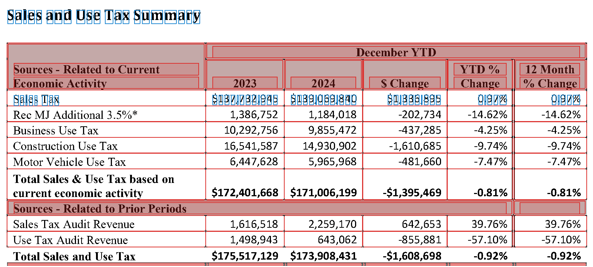
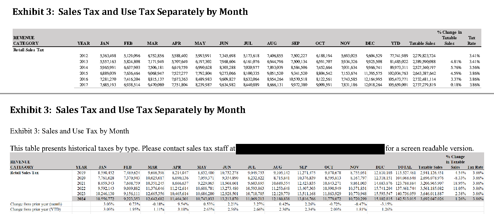

# Extracting Data from PDFs {#sec-pdfs}

::: {.callout-tip}
## Learning Objectives
- Explain what a PDF stores (characters, rectangles, and images placed on a page) and why its text and tables must be reconstructed
- Tell born-digital, scanned, and mixed pages apart before you extract anything
- Download PDFs from a records portal politely, keeping a record of where each came from
- Extract text with pypdf, and words, lines, and tables with pdfplumber, and say what each one reconstructs
- Recover text from a page image with OCR
- Check an extraction with counts, sums, cross-checks, and a sample coded by hand, and use those checks to judge an AI document parser
:::

::: {.callout-tip}
## Companion Notebook
Run this chapter's code as you read: open the [companion notebook](https://github.com/cuinfoscience/Web-Data-Science-Book/blob/main/notebooks/ch-09-pdfs.ipynb) (see @sec-appendix-notebooks for all of them).
:::


## The Web's Filing Cabinets

PDFs are everywhere in institutional record-keeping: city council minutes, legislative bill texts, financial reports, court filings, academic papers, and environmental impact assessments. They are the format of choice for "official" documents because they look the same on every screen and every printer. The records inside them are what @salganik2018bit calls *readymade* data: made by institutions for their own purposes, and reusable, with effort, to answer questions their makers never asked.

The City of Boulder keeps thousands of them in its online records portal: signed City Council minutes back to 2000, budgets, ordinances, and the Finance Department's revenue reports. The revenue report for December 2024 shows both the promise and the problem. Its first pages hold tables of tax revenue whose numbers you can select and copy. Its last page holds a table of sales tax by month for six years that you can't select at all, because it is a picture of a table. Beside it, the city printed a note: "Please contact sales tax staff … for a screen readable version."

When you read a PDF, you see paragraphs, tables, headers, and page numbers. A computer reading the same file sees instructions for drawing the page: put these characters at these coordinates, fill this rectangle, paint this image. Getting data out of a PDF is *reconstruction*, not reading. Software has to infer the words, lines, and tables you see from where things sit on the page, and for a picture of a table, it has to recognize the characters themselves.

So treat the PDF as your last resort, in the same spirit as chapter 8's order of preference for web pages (@sec-dynamic-pages):

1. **Look for the data in a form made for machines**: an open-data portal, an API, or a spreadsheet.
2. **Ask for it.** Colorado's open-records law says that a record kept in a sortable format, such as a spreadsheet, must be provided in that format (C.R.S. 24-72-203(3.5)).
3. **Parse the PDF.**

This chapter is about the third step, which for older records is often the only one available. It starts with the concepts and tools: what a PDF stores, how to tell which kind of PDF you have, how to get the files, what pypdf, pdfplumber, and OCR each reconstruct, and how to check that an extraction is right. Two case studies from Boulder then use all of them: council minutes for text, and revenue reports for tables. The chapter ends with AI document parsers, and with how to judge one.

::: {.callout-note}
## Public Interest Connection
When governments publish minutes, budgets, and filings only as PDFs, they create what @sec-post-api calls "soft enclosure": records that are public in name and hard to analyze in practice. A picture of a table is the extreme case, because neither a screen reader nor a script can read its numbers. Building the skills to extract data from PDFs serves the **oversight** value: it lets people outside an institution analyze its records for themselves.
:::

### This Chapter's Files

The chapter's code reads copies of the city's PDFs that the book keeps on GitHub, so that a class of readers doesn't send hundreds of requests to the city's server at once. "Getting the Files," below, shows where the copies came from and how to download from the portal yourself. Each file downloads once, the first time you ask for it:

```{python}
import requests
from pathlib import Path

# The book's copies of this chapter's files; data/ch-09/manifest.csv says where each one came from
BOOK_DATA = "https://raw.githubusercontent.com/cuinfoscience/Web-Data-Science-Book/main/data/ch-09/"
HEADERS = {"User-Agent": "WebDataScience/1.0 (your-email@colorado.edu)"}
PDF_DIR = Path("pdfs")

def get_saved_copy(name):
    """Return the path of one of the book's saved files, downloading it the first time.

    Parameters
    ----------
    name : str
        A file name in the book's data/ch-09 folder, such as "revenue-report-2024-12.pdf"

    Returns
    -------
    pathlib.Path
        Where the file is on your computer
    """
    path = PDF_DIR / name
    if not path.exists():
        PDF_DIR.mkdir(exist_ok=True)
        response = requests.get(BOOK_DATA + name, headers=HEADERS, timeout=60)
        response.raise_for_status()
        path.write_bytes(response.content)
    return path

report_2024 = get_saved_copy("revenue-report-2024-12.pdf")
print(report_2024, f"{report_2024.stat().st_size:,} bytes")
# pdfs/revenue-report-2024-12.pdf 723,920 bytes
```

The files land in a `pdfs` folder next to your notebook. On Windows, the path prints with a backslash.

## What's Inside a PDF

A PDF page is a list of drawing instructions, which the format calls a *content stream*. Three kinds of things get drawn:

- **Characters.** Each instruction picks a font and a size and places characters at a position. The font maps each character's shape to the Unicode character it stands for. When that map is missing or wrong, extraction returns gibberish from a page that looks fine.
- **Lines and rectangles**: rules, borders, shading, and the grid of a table.
- **Images**: logos, photographs, charts, and, in a scanned document, the whole page.

What most PDFs don't store is any of the structure you see: words, lines of text, paragraphs, columns, tables, or the order in which to read them. The gap between two words may be a space character, or just a wider gap between two characters. Everything else is inferred from position.

You can see this with pdfplumber, which lists every object on a page with its coordinates. Positions are in *points*, 1/72 of an inch, measured from the page's left edge (`x0`) and its top (`top`):

```{python}
import pdfplumber

with pdfplumber.open(report_2024) as pdf:
    page = pdf.pages[1]  # the second page, where the report's tables start
    print(len(pdf.pages), "pages; this one is", page.width, "by", page.height, "points")
    for char in page.chars[1:8]:
        print(repr(char["text"]), round(char["x0"], 1), round(char["top"], 1), char["fontname"], round(char["size"], 1))
    print(len(page.chars), "characters,", len(page.lines), "lines,", len(page.rects), "rectangles,", len(page.images), "images")
# 15 pages; this one is 612.0 by 792.0 points
# 'C' 54.0 30.4 CALYKT+Arial-BoldMT 11.0
# 'i' 61.9 30.4 CALYKT+Arial-BoldMT 11.0
# 't' 65.0 30.4 CALYKT+Arial-BoldMT 11.0
# 'y' 68.8 30.4 CALYKT+Arial-BoldMT 11.0
# ' ' 74.9 30.4 CALYKT+Arial-BoldMT 11.0
# 'o' 78.0 30.4 CALYKT+Arial-BoldMT 11.0
# 'f' 84.6 30.4 CALYKT+Arial-BoldMT 11.0
# 2222 characters, 0 lines, 549 rectangles, 0 images
```

The first seven characters spell "City of", one character at a time. Each carries its own position, font, and size, and "City" is a word only because its four characters sit close together. The table's rules aren't lines at all: they are hundreds of thin, filled rectangles (@fig-pdf-objects). Any tool that finds a table on this page has to rebuild its grid from those rectangles, and its cells from the characters.

{#fig-pdf-objects .lightbox fig-alt="A table titled Sales and Use Tax Summary, comparing December year-to-date tax revenue in 2023 and 2024. Red outlines mark every rectangle the page draws: the table's borders, its shaded header cells, and the thin rules between rows. Each character of the title and of the first row, Sales Tax, $137,732,945 in 2023 and $139,069,840 in 2024, sits in its own blue box. The rows below it, such as Construction Use Tax, are not boxed."}

**Metadata.** A PDF also stores facts about itself: a title, an author, the program that made it, and dates. pypdf reads them:

```{python}
from pypdf import PdfReader

reader = PdfReader(report_2024)
meta = reader.metadata
print(meta.title, "|", meta.subject, "|", meta.creator, "|", meta.creation_date)
# REVENUE REPORT | March 2018 | Acrobat PDFMaker 25 for Word | 2025-05-01 13:20:25-06:00
```

The title and the creator look right. The subject, March 2018, in a report on December 2024, came from the Word template the report started from: five of the city's seven year-end reports carry it. Metadata says what the software wrote, not what is true, so don't date a document by it. The creator is worth reading, though, because it tells you how the file was made, which is what the next section is about.

**Tagged PDFs.** Some PDFs carry a second layer for assistive technology: a *structure tree* that marks headings, paragraphs, tables, and figures, sets the reading order, and holds *alternative text*, which a screen reader speaks in place of an image. PDF/UA (ISO 14289-1) is the standard for doing this well. Six of the seven year-end reports are tagged. In the December 2024 report, the picture of the monthly table has alternative text, and it reads the note again: "This table presents historical taxes by type. Please contact sales tax staff … for a screen readable version." In December 2021, the three pictures of tables say what Word writes when nobody writes anything: "Table. Description automatically generated." Tagging can make a PDF accessible, but only when someone fills it in.

```{python}
print("tagged:", "/StructTreeRoot" in reader.trailer["/Root"])
# tagged: True
```

::: {.callout-note}
## Aside: Where PDF Came From, and What's in the File

PDF grew out of a printer language. In 1984 Adobe released PostScript, a programming language for describing pages: a laser printer ran a PostScript program, and the program drew the page. Around 1990, John Warnock, one of Adobe's founders, wrote a six-page paper called "The Camelot Project" ([Adobe's account](https://blog.adobe.com/en/publish/2018/06/14/evolution-digital-document-celebrating-adobe-acrobats-25th-anniversary)). If every computer could display and print the same page description, he argued, people could send each other documents that looked the same everywhere. Adobe released Acrobat and version 1.0 of the Portable Document Format on June 15, 1993. PDF kept PostScript's way of drawing a page, with fonts, coordinates, lines, and images, and dropped the programming: a PDF page is a fixed list of instructions rather than a program to run. From 1994 Adobe gave Acrobat Reader away, and it published the specification, so anyone could write software that reads or writes PDFs. That is why this chapter's files come from so many makers: Word's PDFMaker, Acrobat Distiller, a Canon scanner, and, for the minutes of 2000, the records portal itself.

The file is a set of numbered *objects*: dictionaries, arrays, numbers, and strings, plus *streams* of compressed bytes, such as fonts, images, and each page's drawing instructions. A *cross-reference table* records where each object starts, so a viewer can jump to page 15 without reading pages 1 to 14; since PDF 1.5 (2003) the table can itself be a compressed stream, as it is in this report. A viewer starts at the end of the file, whose last lines say where that table is ([pypdf's guide to the format](https://pypdf.readthedocs.io/en/latest/dev/pdf-format.html) walks through the parts). Each page object points to the fonts, images, and content stream it uses. Here are the December 2024 report's first bytes, and the instructions that draw its running title on page 2:

```{python}
raw = report_2024.read_bytes()
print(raw[:8])                                   # the header: the format and its version
print(raw[raw.find(b"<<"):raw.find(b">>") + 2])  # the first object: how the file is arranged

stream = reader.pages[1].get_contents().get_data().decode("latin-1")
print(len(stream), "characters of drawing instructions on page 2")
start = stream.find("/TT0 1 Tf")                 # the report's running title, "City of Boulder"
print(stream[start:stream.find("]TJ", start) + 3])

fonts = reader.pages[1]["/Resources"]["/Font"]
print("/TT0 is", fonts["/TT0"]["/BaseFont"])
# b'%PDF-1.6'
# b'<</Linearized 1/L 723920/O 3296/E 219046/N 15/T 723260/H [ 526 432]>>'
# 62267 characters of drawing instructions on page 2
# /TT0 1 Tf
# 11.04 0 0 11.04 54 767.28 Tm
# ( )Tj
# -0.002 Tc 0.007 Tw 0 -1.141 TD
# [(C)2.6 (i)-6.6 (t)-6 (y o)11.2 (f)-6 ( B)2.6 (ou)11.2 (l)-6.6 (der)]TJ
# /TT0 is /CALYKT+Arial-BoldMT
```

The header names the format and its version. The first object says the file is *linearized*, which Acrobat calls "Fast Web View": 723,920 bytes long, with 15 pages, arranged so that the first page's objects come first and a browser can show page 1 while the rest downloads. In the content stream, `Tf` picks the font `/TT0`, Arial Bold. The six letters before the plus sign in its name mark a *subset*: the file holds only the characters the report uses. `Tm` sets the size, 11.04 points, and a position 54 points from the left edge and 767.28 up from the bottom, since PDF counts up from the bottom where pdfplumber's `top` counts down. After a space, `TD` moves down a line, and `TJ` draws the strings in its brackets. "City of Boulder" is stored as nine pieces, `C`, `i`, `t`, `y o`, and so on, with the numbers between them nudging each piece into place. Nothing marks the three words as words, or the line as a title.

Later versions added what the first lacked. Linearization came with PDF 1.2 in 1996. PDF 1.3 added a structure tree, and PDF 1.4 added *tagged PDF* in 2001: the rules for using that tree to record the headings, reading order, and alternative text described above. Tags are optional, so software that makes PDFs could leave them out, and much of it did. PDF became an ISO standard in 2008, as ISO 32000-1, and PDF 2.0 followed as ISO 32000-2 in 2017. Two narrower standards build on it: PDF/A for archives (ISO 19005, from 2005), which requires every font to be embedded and forbids encryption, so a file still opens decades later; and PDF/UA for accessibility (ISO 14289, from 2012), which requires tags.

The same design explains why institutions publish PDFs and why analysts struggle with them. A PDF looks the same on every screen and printer, carries its own fonts, can be signed, and can be kept for decades, which suits a record that must not change. But it describes a printed page, not a document: it doesn't reflow on a phone, it keeps its structure only when someone tags it, and it hands a script positions instead of words. Adobe added a reading mode for phones, Liquid Mode, in 2020. The UK's Government Digital Service drew a different conclusion in 2018: GOV.UK's content should be [HTML by default, not PDF](https://gds.blog.gov.uk/2018/07/16/why-gov-uk-content-should-be-published-in-html-and-not-pdf/), because a PDF doesn't fit the browser's window and is harder to find, use, keep up to date, and make accessible. The chapter's last section returns to what the trade costs the public.
:::

## What Kind of PDF Is It?

Chapter 8 began with three checks for whether a page needs a browser (@sec-dynamic-pages). A PDF needs the same kind of triage before you extract anything, because the right tool depends on how each page was made. There are three kinds:

- **Born-digital** pages come from software, such as Word or a print-to-PDF driver, which writes the characters into the file. The text is there to extract, though its structure must still be rebuilt.
- **Scanned** pages are pictures of paper. The file holds an image and no characters, so text extraction returns nothing. You need *optical character recognition* (OCR), which reads characters from the image.
- **Scanned with a text layer**: someone, often the scanner itself, already ran OCR and hid the text it recognized behind the image. The page looks like a scan, and extraction returns text, but that text is only as good as the OCR that made it.

Files mix them. Boulder's revenue reports are born-digital, but their charts, and in some years their tables, are pictures.

**Check 1: try to select the text.** Open the PDF in a viewer and drag across a line. If the text highlights word by word, the page has characters. If nothing highlights, or the whole page highlights as one block, it's an image.

**Check 2: count characters and images on every page.** This is check 1 done in code, for every page at once:

```{python}
def page_profile(path):
    """Characters of extracted text, and number of images, on each page of a PDF."""
    reader = PdfReader(path)
    return [(len(page.extract_text()), len(page.images)) for page in reader.pages]

for name in ["revenue-report-2024-12.pdf", "revenue-report-2018.pdf", "council-minutes-2018-12-04.pdf"]:
    profile = page_profile(get_saved_copy(name))
    print(name)
    print("  characters:", [chars for chars, images in profile])
    print("  images:    ", [images for chars, images in profile])
# revenue-report-2024-12.pdf
#   characters: [1332, 2279, 2782, 648, 738, 393, 491, 1356, 1390, 676, 3429, 1519, 3797, 4624, 265]
#   images:     [1, 0, 0, 0, 0, 0, 0, 0, 0, 0, 0, 0, 0, 0, 1]
# revenue-report-2018.pdf
#   characters: [1491, 1919, 143, 474, 42, 191, 374, 269, 907, 1273, 3048, 1334, 3031, 3964, 5569]
#   images:     [1, 0, 2, 1, 1, 1, 3, 3, 2, 1, 0, 0, 0, 0, 0]
# council-minutes-2018-12-04.pdf
#   characters: [1718, 1869, 1729, 2381, 2776, 1706, 1665, 1673, 320]
#   images:     [1, 1, 1, 1, 1, 1, 1, 1, 1]
```

Read each file's two lists together:

- **The December 2024 report** has text on every page. Its first page has one image (the city's logo), and its last page has one image and only 265 characters: the picture of the monthly table, and the note beside it.
- **The 2018 annual report** has pages with one to three images and little text: those are its charts. Its last page has 5,569 characters, because in 2018 the same monthly table was text.
- **The minutes from December 4, 2018** have one image and about 1,700 characters on every page. One image filling the page, with plenty of text, is the third kind: a scan with a text layer.

@fig-two-exhibit-3s shows the two reports' last pages. They look alike on screen. Try to select the numbers, though, and only the 2018 table's highlight; the counts above say why.

{#fig-two-exhibit-3s .lightbox fig-alt="Two crops of report pages, one above the other, each titled Exhibit 3: Sales Tax and Use Tax Separately by Month. The top one, from 2018, is a table of retail sales tax by month for 2012 to 2017. The bottom one, from December 2024, is the same kind of table for 2019 to 2024, under a note: This table presents historical taxes by type. Please contact sales tax staff at a blacked-out phone number and email for a screen readable version."}

**Check 3: find out where the text came from.** The minutes' metadata names the machine that made them, and their text shows how well its OCR worked:

```{python}
minutes = PdfReader(get_saved_copy("council-minutes-2018-12-04.pdf"))
print(minutes.metadata.creator, "|", minutes.metadata.creation_date)
for line in minutes.pages[0].extract_text().splitlines()[:3]:
    print(line.strip())
# Canon  | 2019-01-22 10:08:22-07:00
# CITY OF BOULDER
# CITY COTJNCIL MEETING
# Municipal Building, 1777 Broadway
```

The minutes were scanned on a Canon scanner seven weeks after the meeting, and the scanner's OCR read "COUNCIL" as "COTJNCIL". Most of the page fared better. The motions, though, are printed in small capital letters, and on page 7 the scanner turned "Council Member Weaver moved to adopt Ordinance 8302" into "CouNcrr, Mnunrn WnlvnR MovED To ADopr OnorNaNcr 8302", and "The motion passed 8:1 at 9:08 p.m." into "TnB nrorroN plssno 8:1 ar 9:08 p.m." The text layer exists, but in the parts that record the votes, only the numbers survive. Later in the chapter, OCR reads these pages again.

The checks route each page to a tool:

| What the checks show | What the page is | What to do |
|---|---|---|
| Text you can select; characters on the page | Born-digital | Extract the text with pypdf, and the layout and tables with pdfplumber |
| One image on the page, and no characters | Scanned | Run OCR |
| One image, and characters too | Scanned with a text layer | Test the text; if it's poor, run OCR again |
| Text pages, with some image pages | Mixed | Route each page by itself |

## Getting the Files

The saved copies came from the city's records portal, [documents.bouldercolorado.gov](https://documents.bouldercolorado.gov/WebLink/Browse.aspx?id=194345&dbid=0&repo=LF8PROD2), which runs Laserfiche WebLink, software that many local governments use for their records. Open the Revenue Reports folder in a browser and you'll see four year folders and three annual reports. View Source shows almost none of it: the page is a shell that says "Loading...", and JavaScript fills in the list. Chapter 8's way of finding a hidden API (@sec-dynamic-pages, "Check 3: Watch the Network Tab") shows where the list comes from: a request named `GetFolderListing2`, which sends the folder's number and gets back JSON.

::: {.callout-important}
## The city's server leaves out a certificate
Your first request to the portal from Python will probably fail with `SSLError: … CERTIFICATE_VERIFY_FAILED … unable to get local issuer certificate`. The server sends its own certificate, but not the *intermediate* certificate that links it to a root certificate your computer trusts. Browsers find the missing certificate by themselves; Python doesn't.

Don't fix this with `verify=False`, which turns off the check that you're talking to the real server. Pass the book's ready-made bundle instead, `verify=bundle`: it holds the standard root certificates plus that one intermediate. If the city repairs its server, the bundle still works. `data/ch-09/make_ca_bundle.py` in the book's repository shows how the bundle was made.
:::

These two cells are the chapter's only requests to the city's server. Run them at home, not all at once in class: on October 6, 2026, the server stopped answering after 13 to 17 requests in a row, whether they came 30 or 60 seconds apart, and answered again after a five-minute pause. The first cell asks for the Revenue Reports folder's list, as the folder page does:

```{python}
import time

bundle = get_saved_copy("boulder-ca-bundle.pem")
PORTAL = "https://documents.bouldercolorado.gov/WebLink/"

# The JSON the folder page itself sends: 194345 is the Revenue Reports folder
body = {"repoName": "LF8PROD2", "folderId": 194345, "getNewListing": True,
        "start": 0, "end": 100, "sortColumn": "", "sortAscending": True}
response = requests.post(PORTAL + "FolderListingService.aspx/GetFolderListing2",
                         json=body, headers=HEADERS, timeout=60, verify=bundle)
response.raise_for_status()
folder = response.json()["data"]
print(folder["path"], "|", folder["totalEntries"], "entries")
for entry in folder["results"]:
    kind = "folder" if entry["type"] == 0 else f"{entry['data'][1]} pages"
    print(entry["entryId"], entry["name"], f"({kind})")
# \Central Records\Finance\Reports\Revenue Reports | 7 entries
# 194346 2021 (folder)
# 194359 2022 (folder)
# 194372 2023 (folder)
# 194385 2024 (folder)
# 194398 Revenue Report 2018 (15 pages)
# 194399 Revenue Report 2019 (14 pages)
# 194400 Revenue Report 2020 (16 pages)
```

Each document's `entryId` is the number the portal's download address needs. The second cell downloads the December 2024 report, which sits in the 2024 folder:

```{python}
import hashlib

time.sleep(30)  # wait between requests to the city's server
docid = 194397  # Revenue Report 2024.12
url = PORTAL + f"ElectronicFile.aspx?docid={docid}&dbid=0&repo=LF8PROD2"
response = requests.get(url, headers=HEADERS, timeout=120, verify=bundle)
response.raise_for_status()
print(response.headers["Content-Type"], len(response.content), response.content[:5])

# Is the book's saved copy the same file, byte for byte?
print(hashlib.sha256(response.content).hexdigest() == hashlib.sha256(report_2024.read_bytes()).hexdigest())
# application/pdf 723920 b'%PDF-'
# True
```

Check what came back before you parse it. A status of 200 isn't enough: for a record that holds scanned pages rather than a PDF file, the same address answers 200 with an empty body. A PDF starts with the five bytes `%PDF-`, so test them along with the content type. The last line compares a *hash*, a fingerprint of the file's bytes, with the book's copy. `data/ch-09/manifest.csv` records each saved copy's hash, address, and download time, so you can check any of them the same way. The two scanned minutes from 2000 are the exception: the portal builds a new PDF from their page images for every download, so no two copies have the same hash.

This code fits Laserfiche WebLink portals, and this one in particular: the folder number, the repository name `LF8PROD2`, and the request body all come from Boulder's site. What carries over to other portals is the method: watch what the page requests, test one request, check what comes back, and keep a record of every file you take.

## PyPDF Basics

The `pypdf` library provides page-level text extraction and metadata access:

```{python}
# Install if needed:
# pypdf is in webdata (chapter 1); an older environment adds it with: conda install -c conda-forge pypdf

from pypdf import PdfReader

# Open one of the chapter's saved copies (see "This Chapter's Files")
reader = PdfReader(get_saved_copy("council-minutes-2018-12-04.pdf"))

# Document-level metadata
print(f"Number of pages: {len(reader.pages)}")
print(f"Metadata: {reader.metadata}")
```

### Extracting Text

```{python}
# Extract text from the first page
page = reader.pages[0]
text = page.extract_text()
print(text[:500])  # Print the first 500 characters
```

The output will likely be messy: line breaks may not correspond to paragraph boundaries, headers and footers are mixed in with content, and table data may be garbled. This is normal. Cleaning up extracted text is a core part of the workflow.

### Cleanup Strategies

```{python}
import re

def clean_page_text(raw_text):
    """Clean text extracted from a PDF page.
    
    Parameters
    ----------
    raw_text : str
        Raw text from PdfReader.pages[n].extract_text()
    
    Returns
    -------
    str
        Cleaned text with normalized spacing, line breaks preserved
    """
    # Remove page numbers (common patterns)
    text = re.sub(r'Page \d+ of \d+', '', raw_text)

    # Remove common headers/footers (customize per document)
    text = re.sub(r'CITY COUNCIL MEETING MINUTES', '', text)

    # Collapse runs of spaces and tabs — but NOT newlines. Line structure is real information in extracted PDF text (headings sit on their own lines), so we keep it
    text = re.sub(r'[ \t]+', ' ', text)

    # Strip each line and drop lines left empty by the removals above
    lines = [line.strip() for line in text.split('\n')]
    return '\n'.join(line for line in lines if line)

cleaned = clean_page_text(text)
print(cleaned[:300])
```

The most important choice in this function is what *not* to collapse. A tempting one-liner is `re.sub(r'\s+', ' ', raw_text)`, which normalizes all whitespace in a single pass — but `\s` matches newlines too, and flattening the page into one long line destroys structure you will need later. Section headings, for example, are recognizable precisely because they sit alone on their own lines; erase the newlines and no heading detector can find them. Collapsing only spaces and tabs (`[ \t]+`) tidies the text while keeping its shape.

### Regular Expressions for PDF Text

Regular expressions are your primary tool for imposing structure on the messy text that comes out of PDF extraction. Where structured data formats give you fields and columns, PDF text gives you a wall of characters — and regex is how you carve that wall into usable pieces. The patterns below cover the most common extraction tasks you will encounter when working with government and institutional PDFs.

Each pattern targets a specific kind of structured information that appears in unstructured text. Learning to recognize these patterns and adapt them to your specific documents is a skill that improves with practice. No single regex will work across all PDFs, but these five cover a wide range of common scenarios.

```{python}
import re

# 1. Dates in slash-separated format (e.g., "1/15/2024", "12/03/23")
date_pattern = r'\d{1,2}/\d{1,2}/\d{2,4}'
dates = re.findall(date_pattern, cleaned)
# Returns: ['1/15/2024', '2/6/2024', ...]

# 2. Dollar amounts (e.g., "$1,250.00", "$50", "$3,400,000")
dollar_pattern = r'\$[\d,]+\.?\d*'
amounts = re.findall(dollar_pattern, cleaned)
# Returns: ['$1,250.00', '$50', '$3,400,000']

# 3. Repeating headers that PDF extraction duplicates on every page
header_pattern = r'CITY COUNCIL.*?MINUTES'
cleaned = re.sub(header_pattern, '', cleaned)

# 4. Section headings in ALL CAPS on their own line (at least 6 characters, allowing digits and light punctuation for headings like "AGENDA ITEM 5A"). The class matches a literal space, not \s — \s would match newlines too, letting a single match swallow several consecutive heading lines
heading_pattern = r'^[A-Z][A-Z0-9 .:&-]{5,}$'
headings = re.findall(heading_pattern, cleaned, re.MULTILINE)
# Returns: ['CALL TO ORDER', 'PUBLIC COMMENT', 'CONSENT AGENDA', 'ADJOURNMENT', ...]

# 5. Email addresses embedded in document text
email_pattern = r'[\w.+-]+@[\w-]+\.[\w.-]+'
emails = re.findall(email_pattern, cleaned)
# Returns: ['clerk@bouldercolorado.gov', ...]
```

Notice that each of these patterns makes assumptions about the document format. The date pattern assumes slash-separated dates; if your documents use "January 15, 2024" instead, you need a different pattern. The dollar amount pattern assumes a leading `$` sign; budget documents that use parentheses for negative values need additional handling. The section heading pattern assumes uppercase formatting; some documents use title case or bold formatting that does not survive text extraction. Always test your patterns against multiple pages and multiple documents from the same source before committing to a pipeline.

::: {.callout-tip}
## Missing Manual Reference
For a thorough introduction to regular expressions — the pattern-matching tool you will use extensively for text cleanup — see *Missing Manual* Chapter 18: Regular Expressions.
:::

## Case Study: Boulder City Council Minutes

Boulder's City Council publishes signed minutes of its public meetings [online](https://documents.bouldercolorado.gov). These PDFs contain structured information — council member attendance, public comment speakers, agenda items, voting records — that can be extracted and analyzed.

### Measuring Council Attendance

```{python}
import os
from pypdf import PdfReader

# Assuming you have downloaded several PDF files into a directory
pdf_dir = "council_minutes/"
pdf_files = sorted([f for f in os.listdir(pdf_dir) if f.endswith(".pdf")])

def split_names(match):
    """Split a regex match of comma-separated names into a clean list."""
    if not match:
        return []
    return [name.strip() for name in match.group(1).split(",") if name.strip()]

def extract_attendance(pdf_path):
    """Extract council member attendance from a meeting minutes PDF.

    Parameters
    ----------
    pdf_path : str
        Path to the PDF file

    Returns
    -------
    dict
        Dictionary with 'file', 'date', 'present', and 'absent' —
        the last two are lists of council member names
    """
    reader = PdfReader(pdf_path)

    # Attendance is typically on the first page
    first_page_text = reader.pages[0].extract_text()

    # Cheap date extraction: filenames like council_minutes_2024_01.pdf encode the year and month — parse them rather than the PDF text
    date_match = re.search(r'(\d{4})[_-](\d{2})', os.path.basename(pdf_path))
    meeting_date = f"{date_match.group(1)}-{date_match.group(2)}" if date_match else None

    # Names follow "Present:" — capture up to "Absent:" if it appears on the same line, otherwise up to the end of the line
    present_match = re.search(r'Present:\s*(.*?)\s*(?:Absent:|$)',
                              first_page_text, re.IGNORECASE | re.MULTILINE)

    # Names after "Absent:" run to the end of that line
    absent_match = re.search(r'Absent:\s*(.*)$',
                             first_page_text, re.IGNORECASE | re.MULTILINE)

    return {
        "file": os.path.basename(pdf_path),
        "date": meeting_date,
        "present": split_names(present_match),
        "absent": split_names(absent_match),
    }
```

Be honest with yourself about what this function can and cannot do. It assumes the clerk wrote a line beginning "Present:" followed by comma-separated names — a format that holds for many Boulder minutes, but not all. Name formats vary ("Council Member Smith" versus "Smith," with or without titles), some documents separate names with semicolons or line breaks, and minutes where everyone attended often read "Absent: None," which this code will dutifully report as a council member named None. Treat the output as a first draft: spot-check it against a handful of PDFs, patch the patterns to match the formats you actually encounter, and document the failure cases you decide not to handle.

### Building the Pipeline

```{python}
results = []
for pdf_file in pdf_files:
    try:
        pdf_path = os.path.join(pdf_dir, pdf_file)
        result = extract_attendance(pdf_path)
        results.append(result)
        print(f"Processed: {pdf_file}")
    except Exception as e:
        print(f"Error processing {pdf_file}: {e}")

import pandas as pd

df = pd.DataFrame(results)

# Turn the name lists into counts for analysis
df["n_present"] = df["present"].apply(len)
df["n_absent"] = df["absent"].apply(len)
print(df.head())
```

### Visualizing Trends

```{python}
import matplotlib.pyplot as plt

plt.figure(figsize=(12, 5))
plt.bar(range(len(df)), df["n_present"])
plt.xlabel("Meeting")
plt.ylabel("Council Members Present")
plt.title("Boulder City Council Attendance Over Time")
plt.tight_layout()
plt.show()
```

### Measuring Public Comment Frequency

One of the most civically valuable pieces of information buried in meeting minutes is how many members of the public showed up to speak. Public comment sections are where residents voice concerns about zoning changes, police oversight, budget priorities, and development projects. Extracting this data requires detective work: you need to identify the textual markers that signal a public comment section and then count the speakers within it.

The challenge is that different municipalities format public comment sections differently, and even within the same city, the format may shift over time as clerks change or recording practices evolve. You are looking for patterns — section headers like "PUBLIC COMMENT" or "PUBLIC HEARING," followed by names or numbered items indicating individual speakers. This is the kind of work where you iterate: try a pattern on one document, inspect the results manually, refine the pattern, test it on a second document, and adjust again. Start by printing the raw text of several public comment sections to understand the format before writing any extraction code.

```{python}
def count_public_comments(text):
    """Count the number of public comment speakers in meeting text.

    Parameters
    ----------
    text : str
        Full text extracted from a meeting minutes PDF

    Returns
    -------
    int
        Estimated number of public comment speakers
    """
    # Find the public comment section
    comment_section = re.search(
        r'(?:PUBLIC COMMENT|PUBLIC HEARING)(.*?)(?:CONSENT AGENDA|OLD BUSINESS|NEW BUSINESS)',
        text, re.DOTALL | re.IGNORECASE
    )

    if not comment_section:
        return 0

    section_text = comment_section.group(1)

    # Count speakers by looking for common patterns
    # Pattern 1: "spoke regarding" or "spoke about" or "spoke in favor"
    spoke_count = len(re.findall(r'spoke\s+(?:regarding|about|in|on|to)',
                                  section_text, re.IGNORECASE))

    # Pattern 2: numbered items like "1." "2." "3."
    numbered_count = len(re.findall(r'^\s*\d+\.', section_text, re.MULTILINE))

    # Return the higher count (different formats capture different patterns)
    return max(spoke_count, numbered_count)
```

```{python}
# Apply across all meeting files
comment_counts = []
for pdf_file in pdf_files:
    pdf_path = os.path.join(pdf_dir, pdf_file)
    try:
        reader = PdfReader(pdf_path)
        full_text = " ".join([p.extract_text() for p in reader.pages])
        count = count_public_comments(full_text)
        comment_counts.append({"file": pdf_file, "speakers": count})
    except Exception as e:
        comment_counts.append({"file": pdf_file, "speakers": 0})

df_comments = pd.DataFrame(comment_counts)

plt.figure(figsize=(12, 5))
plt.bar(range(len(df_comments)), df_comments["speakers"])
plt.xlabel("Meeting")
plt.ylabel("Public Comment Speakers")
plt.title("Public Comment Participation in Boulder City Council Meetings")
plt.tight_layout()
plt.show()
```

What does this data reveal? Spikes in public comment frequency often correspond to controversial agenda items — a proposed development project, a change in policing policy, or a budget reallocation. Periods of low participation may indicate either public satisfaction or public disengagement. Neither interpretation is self-evident from the data alone, which is why combining extracted counts with knowledge of the agenda (also extractable from the same PDFs) produces richer analysis.

This kind of measurement is inherently imperfect. Your regex patterns will miss some speakers and occasionally count non-speakers. But even approximate counts, applied consistently across dozens of meetings, reveal patterns that would be invisible to someone reading a single set of minutes. The imprecision of PDF extraction is the price of scale — and scale is what transforms individual documents into a dataset.

## Building a Reusable PDF Pipeline

When you work with PDFs at scale — processing dozens or hundreds of documents from the same source — you need a structured pipeline. Here is a pattern that works for most government document collections:

```{python}
import os
import re
import pandas as pd
from pypdf import PdfReader

class PDFCorpusAnalyzer:
    """A reusable pipeline for extracting and analyzing PDF corpora.
    
    This class encapsulates the full workflow:
    1. Discover PDF files in a directory
    2. Extract text from each file
    3. Apply document-specific cleanup rules
    4. Extract structured fields
    5. Compile results into a DataFrame
    """
    
    def __init__(self, directory, cleanup_patterns=None):
        self.directory = directory
        self.cleanup_patterns = cleanup_patterns or []
        self.files = sorted([
            f for f in os.listdir(directory) if f.lower().endswith(".pdf")
        ])
    
    def extract_text(self, filepath, pages=None):
        """Extract text from specified pages of a PDF."""
        reader = PdfReader(filepath)
        
        if pages is None:
            pages = range(len(reader.pages))
        
        text = ""
        for page_num in pages:
            if page_num < len(reader.pages):
                text += reader.pages[page_num].extract_text() + "\n"
        
        # Apply cleanup patterns
        for pattern, replacement in self.cleanup_patterns:
            text = re.sub(pattern, replacement, text)
        
        return text.strip()
    
    def process_all(self, extract_fn):
        """Process all PDFs using a custom extraction function.
        
        Parameters
        ----------
        extract_fn : callable
            Function that takes (filepath, text) and returns a dict
        """
        results = []
        for filename in self.files:
            filepath = os.path.join(self.directory, filename)
            try:
                text = self.extract_text(filepath)
                result = extract_fn(filepath, text)
                result["filename"] = filename
                results.append(result)
            except Exception as e:
                print(f"Error processing {filename}: {e}")
                results.append({"filename": filename, "error": str(e)})
        
        return pd.DataFrame(results)

# Usage example: analyze Boulder City Council meeting lengths
def extract_meeting_info(filepath, text):
    """Extract meeting metadata from council minutes text."""
    # Count approximate words
    word_count = len(text.split())
    
    # Try to find the meeting date (format varies by document)
    date_match = re.search(
        r'(January|February|March|April|May|June|July|August|'
        r'September|October|November|December)\s+\d{1,2},\s+\d{4}',
        text
    )
    
    return {
        "word_count": word_count,
        "date": date_match.group(0) if date_match else None,
        "page_count": len(PdfReader(filepath).pages)
    }

analyzer = PDFCorpusAnalyzer(
    "council_minutes/",
    cleanup_patterns=[
        (r'[ \t]+', ' '),               # Collapse spaces/tabs, keep line breaks
        (r'Page \d+ of \d+', ''),       # Remove page numbers
    ]
)

df = analyzer.process_all(extract_meeting_info)
print(df.head())
```

### When PyPDF Is Not Enough

PyPDF handles text-based PDFs well but struggles with two common scenarios:

**Tables in PDFs**: PyPDF extracts tables as streams of text, losing the column-row structure. For tabular PDF data, use `pdfplumber`, which preserves spatial relationships:

```{python}
# pdfplumber is in webdata (chapter 1); an older environment adds it with: conda install -c conda-forge pdfplumber
import pdfplumber

with pdfplumber.open("report.pdf") as pdf:
    page = pdf.pages[0]
    table = page.extract_table()
    
    # table is a list of lists (rows of cells)
    df = pd.DataFrame(table[1:], columns=table[0])
```

**Scanned PDFs**: If the PDF was created by scanning a physical document (no text layer), PyPDF will extract empty or garbled text. You need OCR (Optical Character Recognition). The Tesseract OCR engine, accessible through the `pytesseract` library, can process scanned pages, though accuracy varies with scan quality.

## Recommended Exercises

This guided exercise is the chapter's take-home assignment. Work through it in the companion notebook, filling in each empty code cell, and submit the completed notebook. The steps build on one another, so do them in order — everything you need appears in this chapter or an earlier one.

You will build a small PDF-to-DataFrame pipeline on real government documents: download, extract, clean, search, and tabulate.

**Step 1 — Collect three PDFs.** Find three PDF documents from one government source — city council minutes or agendas, board meeting minutes, budget summaries. Download each with `requests` and your `HEADERS` (@sec-ethics), sleeping between downloads, and save them into a `pdfs/` directory — the caching discipline from @sec-static-pages, applied to documents.

```{python}
# Step 1: Download three PDFs from one government source, politely, into a pdfs/ directory.
# Your code here
```

**Step 2 — Open and inspect.** Open one of them with `PdfReader`. Print the number of pages and the raw extracted text of the first page.

```{python}
# Step 2: Open one PDF with PdfReader; print the page count and the raw text of page one.
# Your code here
```

**Step 3 — Clean the text.** Raw extraction is messy. Apply the chapter's cleanup strategies — normalize whitespace, rejoin broken lines — and print the same passage before and after, so the difference is visible.

```{python}
# Step 3: Write a cleanup function and show a before/after comparison.
# Your code here
```

**Step 4 — Extract a data element with a regex.** Choose one consistent element to pull from the text — dates, dollar amounts, a name pattern, occurrences of a topic word — and extract it with `re.findall()`, following the chapter's patterns. Print what you found in your first document.

```{python}
# Step 4: Use re.findall to extract your chosen element from one document.
# Your code here
```

**Step 5 — Scale to the corpus.** Loop the whole pipeline — read, clean, extract — over all three PDFs, collecting one row per document into a DataFrame: filename, page count, characters of text extracted, and the count (or values) of your element.

```{python}
# Step 5: Run the pipeline over all three PDFs and build a summary DataFrame.
# Your code here
```

**Step 6 — Visualize and inspect quality.** Plot your element's count per document. Then look at the characters-per-page figure for each document: did any document yield suspiciously little text?

```{python}
# Step 6: Plot the element counts and compute characters per page for each document.
# Your code here
```

**Step 7 — Interpret.** In four to six sentences: What did your element's variation across documents suggest? Where did extraction quality worry you — and is the culprit the PDF (a scanned image, a complex layout) or your regex? What would you have to add before trusting this pipeline on a hundred documents?

```{python}
# Step 7: Write your answer here as comments, or convert this cell to Markdown.
```

## Additional Exercises

These are open-ended extensions — no scaffold, no fixed path. Use them for further practice or deeper exploration.

1. **Extraction quality comparison.** Compare the text extraction quality of PyPDF on three different types of PDFs: a text-based report, a document with complex tables, and a slide deck exported to PDF. What works well and what fails?

2. **Tables, not text.** Find a government PDF that contains a budget or financial table — a city budget summary, a department expenditure report, or a school district financial statement. First extract the page with `pypdf` and observe what happens to the table's structure. Then extract the same table with `pdfplumber`'s `extract_table()` and build a proper DataFrame with numeric columns. Briefly describe what spatial information `pdfplumber` uses that plain text extraction throws away, and when that extra dependency is worth it.

3. **Topic tracking.** Download a year's worth of city council meeting minutes (roughly 12–24 PDFs). Choose a topic term relevant to local politics — "housing," "police," "flood," "budget" — and count how often it appears in each meeting's extracted text. Plot the frequency over time and identify the meetings where the topic spiked. For a measure more robust than raw counts, apply the bag-of-words preprocessing from @sec-archives (tokenization, stopword removal) before counting, and normalize by each document's length. What events or agenda items explain the spikes?

4. **Tool comparison.** Install `pdfplumber` alongside `pypdf`. Extract text from the same PDF using both tools. Compare the quality of text extraction — line breaks, whitespace handling, table detection. Which tool handles your specific PDF better, and why?

5. **Graduate extension (INFO 5617).** Sample at least ten municipal-meeting PDFs from each of two different cities and quantify extraction quality across the two corpora: characters extracted per page, the share of pages yielding little or no text, and whether any documents are scanned images that would require OCR. Then write a data-quality memo organized around the datasheet categories of @gebru2021datasheets — motivation, composition, collection process, preprocessing, and recommended uses — documenting what a downstream researcher would need to know before trusting analyses built on these extractions.

## Social History and Public Interest

The PDF format was created by Adobe in 1993 to solve a real problem: documents needed to look the same regardless of what printer or screen displayed them. But the format's emphasis on visual fidelity came at the cost of semantic accessibility. Organizations like DocumentCloud, MuckRock, and the Sunlight Foundation have built tools to extract structured data from the flood of PDFs that government agencies produce — bridging the gap between nominally public records and practically accessible data.

DocumentCloud, built by ProPublica and IRE (Investigative Reporters and Editors), emerged as a platform where journalists could upload, analyze, annotate, and share document collections. It has been used in investigations of police misconduct records, corporate fraud filings, and government secrecy — cases where the raw documents are public but the volume makes manual analysis impractical. DocumentCloud's contribution was not just technical but organizational: it created a shared infrastructure where one journalist's document processing work could benefit others investigating the same institutions.

MuckRock took a different approach to the document access problem by automating the Freedom of Information Act (FOIA) request process itself. The platform helped journalists and citizens file thousands of public records requests, tracked agency response times, and published the results openly. The Sunlight Foundation, active from 2006 to 2020, advocated for government agencies to publish documents in machine-readable formats rather than PDFs in the first place — arguing that true transparency requires not just publication but *usability*. Together, these tools and organizations represent the infrastructure of transparency: community-built resources that bridge the gap between nominally public documents and practically accessible data. Their work embodies the **ownership** value from @sec-post-api — the idea that public records belong to the public, and that technical barriers to access are themselves a form of enclosure that undermines democratic accountability.

The Boulder City Council case illustrates this tension at the local level. The same meeting information could be published as structured data (allowing citizens to easily track attendance, voting patterns, and public comment frequency) or as scanned PDFs (requiring significant technical effort to analyze). The format choice is itself a policy decision with consequences for transparency and accountability. When you build a pipeline that extracts structured data from PDFs, you are not just doing data science — you are doing the work that these organizations have championed for decades.

## Common Issues to Debug

- **Garbled text from scanned PDFs**: PyPDF extracts text only from PDFs that have a text layer. Truly scanned documents require OCR tools like Tesseract.
- **Table data extracted as a text stream**: PyPDF is not a table extraction tool. For tabular data in PDFs, consider `pdfplumber` or `camelot`.
- **Regular expressions that work on one document but fail on another**: PDF formatting varies even within documents from the same source. Test your patterns on multiple files.
- **Encoding issues**: Some PDFs use non-standard character encodings. Use `.encode('utf-8', errors='replace')` if needed.

## Key Takeaways

PDFs are designed for visual fidelity, not data extraction. PyPDF gives you page-level text as a starting point; string methods and regex let you clean and structure what you extract; and function abstractions let you process many documents consistently. Expect messiness — PDF extraction is reconstruction, not reading. The broader lesson connects to @sec-post-api: when institutions publish data only in PDF form, they create a practical barrier to the analysis that nominally public records are meant to enable.

## Further Reading

- PyPDF documentation: <https://pypdf.readthedocs.io/>
- pdfplumber (for table extraction): <https://github.com/jsvine/pdfplumber>
- Python `re` module: <https://docs.python.org/3/library/re.html>
- DocumentCloud: <https://www.documentcloud.org/>
