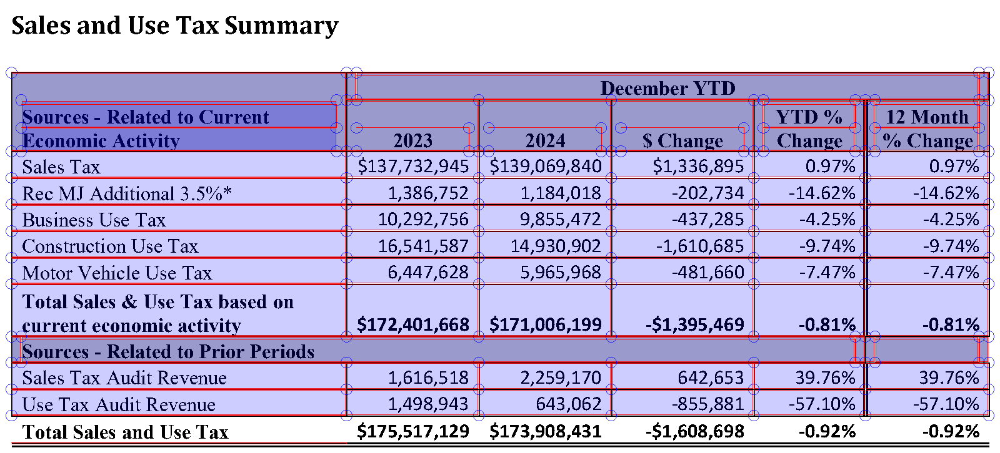

# Extracting Data from PDFs {#sec-pdfs}

::: {.callout-tip}
## Learning Objectives
- Explain what a PDF stores (characters, rectangles, and images placed on a page) and why its text and tables must be reconstructed
- Tell born-digital, scanned, and mixed pages apart before you extract anything
- Download PDFs from a records portal politely, keeping a record of where each came from
- Extract text with pypdf, and words, lines, and tables with pdfplumber, and say what each one reconstructs
- Recover text from a page image with OCR
- Check an extraction with counts, sums, cross-checks, and a sample coded by hand, and use those checks to judge an AI document parser
:::

::: {.callout-tip}
## Companion Notebook
Run this chapter's code as you read: open the [companion notebook](https://github.com/cuinfoscience/Web-Data-Science-Book/blob/main/notebooks/ch-09-pdfs.ipynb) (see @sec-appendix-notebooks for all of them).
:::


## The Web's Filing Cabinets

PDFs are everywhere in institutional record-keeping: city council minutes, legislative bill texts, financial reports, court filings, academic papers, and environmental impact assessments. They are the format of choice for "official" documents because they look the same on every screen and every printer. The records inside them are what @salganik2018bit calls *readymade* data: made by institutions for their own purposes, and reusable, with effort, to answer questions their makers never asked.

The City of Boulder keeps thousands of them in its online records portal: signed City Council minutes back to 2000, budgets, ordinances, and the Finance Department's revenue reports. The revenue report for December 2024 shows both the promise and the problem. Its first pages hold tables of tax revenue whose numbers you can select and copy. Its last page holds a table of sales tax by month for six years that you can't select at all, because it is a picture of a table. Beside it, the city printed a note: "Please contact sales tax staff … for a screen readable version."

When you read a PDF, you see paragraphs, tables, headers, and page numbers. A computer reading the same file sees instructions for drawing the page: put these characters at these coordinates, fill this rectangle, paint this image. Getting data out of a PDF is *reconstruction*, not reading. Software has to infer the words, lines, and tables you see from where things sit on the page, and for a picture of a table, it has to recognize the characters themselves.

So treat the PDF as your last resort, in the same spirit as chapter 8's order of preference for web pages (@sec-dynamic-pages):

1. **Look for the data in a form made for machines**: an open-data portal, an API, or a spreadsheet.
2. **Ask for it.** Colorado's open-records law says that a record kept in a sortable format, such as a spreadsheet, must be provided in that format (C.R.S. 24-72-203(3.5)).
3. **Parse the PDF.**

This chapter is about the third step, which for older records is often the only one available. It starts with the concepts and tools: what a PDF stores, how to tell which kind of PDF you have, how to get the files, what pypdf, pdfplumber, and OCR each reconstruct, and how to check that an extraction is right. Two case studies from Boulder then use all of them: council minutes for text, and revenue reports for tables. The chapter ends with AI document parsers, and with how to judge one.

::: {.callout-note}
## Public Interest Connection
When governments publish minutes, budgets, and filings only as PDFs, they create what @sec-post-api calls "soft enclosure": records that are public in name and hard to analyze in practice. A picture of a table is the extreme case, because neither a screen reader nor a script can read its numbers. Building the skills to extract data from PDFs serves the **oversight** value: it lets people outside an institution analyze its records for themselves.
:::

### This Chapter's Files

The chapter's code reads copies of the city's PDFs that the book keeps on GitHub, so that a class of readers doesn't send hundreds of requests to the city's server at once. "Getting the Files," below, shows where the copies came from and how to download from the portal yourself. Each file downloads once, the first time you ask for it:

```{python}
import requests
from pathlib import Path

# The book's copies of this chapter's files; data/ch-09/manifest.csv says where each one came from
BOOK_DATA = "https://raw.githubusercontent.com/cuinfoscience/Web-Data-Science-Book/main/data/ch-09/"
HEADERS = {"User-Agent": "WebDataScience/1.0 (your-email@colorado.edu)"}
PDF_DIR = Path("pdfs")

def get_saved_copy(name):
    """Return the path of one of the book's saved files, downloading it the first time.

    Parameters
    ----------
    name : str
        A file name in the book's data/ch-09 folder, such as "revenue-report-2024-12.pdf"

    Returns
    -------
    pathlib.Path
        Where the file is on your computer
    """
    path = PDF_DIR / name
    if not path.exists():
        PDF_DIR.mkdir(exist_ok=True)
        response = requests.get(BOOK_DATA + name, headers=HEADERS, timeout=60)
        response.raise_for_status()
        path.write_bytes(response.content)
    return path

report_2024 = get_saved_copy("revenue-report-2024-12.pdf")
print(report_2024, f"{report_2024.stat().st_size:,} bytes")
# pdfs/revenue-report-2024-12.pdf 723,920 bytes
```

The files land in a `pdfs` folder next to your notebook. On Windows, the path prints with a backslash.

## What's Inside a PDF

A PDF page is a list of drawing instructions, which the format calls a *content stream*. Three kinds of things get drawn:

- **Characters.** Each instruction picks a font and a size and places characters at a position. The font maps each character's shape to the Unicode character it stands for. When that map is missing or wrong, extraction returns gibberish from a page that looks fine.
- **Lines and rectangles**: rules, borders, shading, and the grid of a table.
- **Images**: logos, photographs, charts, and, in a scanned document, the whole page.

What most PDFs don't store is any of the structure you see: words, lines of text, paragraphs, columns, tables, or the order in which to read them. The gap between two words may be a space character, or just a wider gap between two characters. Everything else is inferred from position.

You can see this with pdfplumber, which lists every object on a page with its coordinates. Positions are in *points*, 1/72 of an inch, measured from the page's left edge (`x0`) and its top (`top`):

```{python}
import pdfplumber

with pdfplumber.open(report_2024) as pdf:
    page = pdf.pages[1]  # the second page, where the report's tables start
    print(len(pdf.pages), "pages; this one is", page.width, "by", page.height, "points")
    for char in page.chars[1:8]:
        print(repr(char["text"]), round(char["x0"], 1), round(char["top"], 1), char["fontname"], round(char["size"], 1))
    print(len(page.chars), "characters,", len(page.lines), "lines,", len(page.rects), "rectangles,", len(page.images), "images")
# 15 pages; this one is 612.0 by 792.0 points
# 'C' 54.0 30.4 CALYKT+Arial-BoldMT 11.0
# 'i' 61.9 30.4 CALYKT+Arial-BoldMT 11.0
# 't' 65.0 30.4 CALYKT+Arial-BoldMT 11.0
# 'y' 68.8 30.4 CALYKT+Arial-BoldMT 11.0
# ' ' 74.9 30.4 CALYKT+Arial-BoldMT 11.0
# 'o' 78.0 30.4 CALYKT+Arial-BoldMT 11.0
# 'f' 84.6 30.4 CALYKT+Arial-BoldMT 11.0
# 2222 characters, 0 lines, 549 rectangles, 0 images
```

The first seven characters spell "City of", one character at a time. Each carries its own position, font, and size, and "City" is a word only because its four characters sit close together. The table's rules aren't lines at all: they are hundreds of thin, filled rectangles (@fig-pdf-objects). Any tool that finds a table on this page has to rebuild its grid from those rectangles, and its cells from the characters.

{#fig-pdf-objects .lightbox fig-alt="A table titled Sales and Use Tax Summary, comparing December year-to-date tax revenue in 2023 and 2024. Red outlines mark every rectangle the page draws: the table's borders, its shaded header cells, and the thin rules between rows. Each character of the title and of the first row, Sales Tax, $137,732,945 in 2023 and $139,069,840 in 2024, sits in its own blue box. The rows below it, such as Construction Use Tax, are not boxed."}

**Metadata.** A PDF also stores facts about itself: a title, an author, the program that made it, and dates. pypdf reads them:

```{python}
from pypdf import PdfReader

reader = PdfReader(report_2024)
meta = reader.metadata
print(meta.title, "|", meta.subject, "|", meta.creator, "|", meta.creation_date)
# REVENUE REPORT | March 2018 | Acrobat PDFMaker 25 for Word | 2025-05-01 13:20:25-06:00
```

The title and the creator look right. The subject, March 2018, in a report on December 2024, came from the Word template the report started from: five of the city's seven year-end reports carry it. Metadata says what the software wrote, not what is true, so don't date a document by it. The creator is worth reading, though, because it tells you how the file was made, which is what the next section is about.

**Tagged PDFs.** Some PDFs carry a second layer for assistive technology: a *structure tree* that marks headings, paragraphs, tables, and figures, sets the reading order, and holds *alternative text*, which a screen reader speaks in place of an image. PDF/UA (ISO 14289-1) is the standard for doing this well. Six of the seven year-end reports are tagged. In the December 2024 report, the picture of the monthly table has alternative text, and it reads the note again: "This table presents historical taxes by type. Please contact sales tax staff … for a screen readable version." In December 2021, the three pictures of tables say what Word writes when nobody writes anything: "Table. Description automatically generated." Tagging can make a PDF accessible, but only when someone fills it in.

```{python}
print("tagged:", "/StructTreeRoot" in reader.trailer["/Root"])
# tagged: True
```

::: {.callout-note}
## Aside: Where PDF Came From, and What's in the File

PDF grew out of a printer language. In 1984 Adobe released PostScript, a programming language for describing pages: a laser printer ran a PostScript program, and the program drew the page. Around 1990, John Warnock, one of Adobe's founders, wrote a six-page paper called "The Camelot Project" ([Adobe's account](https://blog.adobe.com/en/publish/2018/06/14/evolution-digital-document-celebrating-adobe-acrobats-25th-anniversary)). If every computer could display and print the same page description, he argued, people could send each other documents that looked the same everywhere. Adobe released Acrobat and version 1.0 of the Portable Document Format on June 15, 1993. PDF kept PostScript's way of drawing a page, with fonts, coordinates, lines, and images, and dropped the programming: a PDF page is a fixed list of instructions rather than a program to run. From 1994 Adobe gave Acrobat Reader away, and it published the specification, so anyone could write software that reads or writes PDFs. That is why this chapter's files come from so many makers: Word's PDFMaker, Acrobat Distiller, a Canon scanner, and, for the minutes of 2000, the records portal itself.

The file is a set of numbered *objects*: dictionaries, arrays, numbers, and strings, plus *streams* of compressed bytes, such as fonts, images, and each page's drawing instructions. A *cross-reference table* records where each object starts, so a viewer can jump to page 15 without reading pages 1 to 14; since PDF 1.5 (2003) the table can itself be a compressed stream, as it is in this report. A viewer starts at the end of the file, whose last lines say where that table is ([pypdf's guide to the format](https://pypdf.readthedocs.io/en/latest/dev/pdf-format.html) walks through the parts). Each page object points to the fonts, images, and content stream it uses. Here are the December 2024 report's first bytes, and the instructions that draw its running title on page 2:

```{python}
raw = report_2024.read_bytes()
print(raw[:8])                                   # the header: the format and its version
print(raw[raw.find(b"<<"):raw.find(b">>") + 2])  # the first object: how the file is arranged

stream = reader.pages[1].get_contents().get_data().decode("latin-1")
print(len(stream), "characters of drawing instructions on page 2")
start = stream.find("/TT0 1 Tf")                 # the report's running title, "City of Boulder"
print(stream[start:stream.find("]TJ", start) + 3])

fonts = reader.pages[1]["/Resources"]["/Font"]
print("/TT0 is", fonts["/TT0"]["/BaseFont"])
# b'%PDF-1.6'
# b'<</Linearized 1/L 723920/O 3296/E 219046/N 15/T 723260/H [ 526 432]>>'
# 62267 characters of drawing instructions on page 2
# /TT0 1 Tf
# 11.04 0 0 11.04 54 767.28 Tm
# ( )Tj
# -0.002 Tc 0.007 Tw 0 -1.141 TD
# [(C)2.6 (i)-6.6 (t)-6 (y o)11.2 (f)-6 ( B)2.6 (ou)11.2 (l)-6.6 (der)]TJ
# /TT0 is /CALYKT+Arial-BoldMT
```

The header names the format and its version. The first object says the file is *linearized*, which Acrobat calls "Fast Web View": 723,920 bytes long, with 15 pages, arranged so that the first page's objects come first and a browser can show page 1 while the rest downloads. In the content stream, `Tf` picks the font `/TT0`, Arial Bold. The six letters before the plus sign in its name mark a *subset*: the file holds only the characters the report uses. `Tm` sets the size, 11.04 points, and a position 54 points from the left edge and 767.28 up from the bottom, since PDF counts up from the bottom where pdfplumber's `top` counts down. After a space, `TD` moves down a line, and `TJ` draws the strings in its brackets. "City of Boulder" is stored as nine pieces, `C`, `i`, `t`, `y o`, and so on, with the numbers between them nudging each piece into place. Nothing marks the three words as words, or the line as a title.

Later versions added what the first lacked. Linearization came with PDF 1.2 in 1996. PDF 1.3 added a structure tree, and PDF 1.4 added *tagged PDF* in 2001: the rules for using that tree to record the headings, reading order, and alternative text described above. Tags are optional, so software that makes PDFs could leave them out, and much of it did. PDF became an ISO standard in 2008, as ISO 32000-1, and PDF 2.0 followed as ISO 32000-2 in 2017. Two narrower standards build on it: PDF/A for archives (ISO 19005, from 2005), which requires every font to be embedded and forbids encryption, so a file still opens decades later; and PDF/UA for accessibility (ISO 14289, from 2012), which requires tags.

The same design explains why institutions publish PDFs and why analysts struggle with them. A PDF looks the same on every screen and printer, carries its own fonts, can be signed, and can be kept for decades, which suits a record that must not change. But it describes a printed page, not a document: it doesn't reflow on a phone, it keeps its structure only when someone tags it, and it hands a script positions instead of words. Adobe added a reading mode for phones, Liquid Mode, in 2020. The UK's Government Digital Service drew a different conclusion in 2018: GOV.UK's content should be [HTML by default, not PDF](https://gds.blog.gov.uk/2018/07/16/why-gov-uk-content-should-be-published-in-html-and-not-pdf/), because a PDF doesn't fit the browser's window and is harder to find, use, keep up to date, and make accessible. The chapter's last section returns to what the trade costs the public.
:::

## What Kind of PDF Is It?

Chapter 8 began with three checks for whether a page needs a browser (@sec-dynamic-pages). A PDF needs the same kind of triage before you extract anything, because the right tool depends on how each page was made. There are three kinds:

- **Born-digital** pages come from software, such as Word or a print-to-PDF driver, which writes the characters into the file. The text is there to extract, though its structure must still be rebuilt.
- **Scanned** pages are pictures of paper. The file holds an image and no characters, so text extraction returns nothing. You need *optical character recognition* (OCR), which reads characters from the image.
- **Scanned with a text layer**: someone, often the scanner itself, already ran OCR and hid the text it recognized behind the image. The page looks like a scan, and extraction returns text, but that text is only as good as the OCR that made it.

Files mix them. Boulder's revenue reports are born-digital, but their charts, and in some years their tables, are pictures.

**Check 1: try to select the text.** Open the PDF in a viewer and drag across a line. If the text highlights word by word, the page has characters. If nothing highlights, or the whole page highlights as one block, it's an image.

**Check 2: count characters and images on every page.** This is check 1 done in code, for every page at once:

```{python}
def page_profile(path):
    """Characters of extracted text, and number of images, on each page of a PDF."""
    reader = PdfReader(path)
    return [(len(page.extract_text()), len(page.images)) for page in reader.pages]

for name in ["revenue-report-2024-12.pdf", "revenue-report-2018.pdf", "council-minutes-2018-12-04.pdf"]:
    profile = page_profile(get_saved_copy(name))
    print(name)
    print("  characters:", [chars for chars, images in profile])
    print("  images:    ", [images for chars, images in profile])
# revenue-report-2024-12.pdf
#   characters: [1332, 2279, 2782, 648, 738, 393, 491, 1356, 1390, 676, 3429, 1519, 3797, 4624, 265]
#   images:     [1, 0, 0, 0, 0, 0, 0, 0, 0, 0, 0, 0, 0, 0, 1]
# revenue-report-2018.pdf
#   characters: [1491, 1919, 143, 474, 42, 191, 374, 269, 907, 1273, 3048, 1334, 3031, 3964, 5569]
#   images:     [1, 0, 2, 1, 1, 1, 3, 3, 2, 1, 0, 0, 0, 0, 0]
# council-minutes-2018-12-04.pdf
#   characters: [1718, 1869, 1729, 2381, 2776, 1706, 1665, 1673, 320]
#   images:     [1, 1, 1, 1, 1, 1, 1, 1, 1]
```

Read each file's two lists together:

- **The December 2024 report** has text on every page. Its first page has one image (the city's logo), and its last page has one image and only 265 characters: the picture of the monthly table, and the note beside it.
- **The 2018 annual report** has pages with one to three images and little text: those are its charts. Its last page has 5,569 characters, because in 2018 the same monthly table was text.
- **The minutes from December 4, 2018** have one image and about 1,700 characters on every page. One image filling the page, with plenty of text, is the third kind: a scan with a text layer.

@fig-two-exhibit-3s shows the two reports' last pages. They look alike on screen. Try to select the numbers, though, and only the 2018 table's highlight; the counts above say why.

{#fig-two-exhibit-3s .lightbox fig-alt="Two crops of report pages, one above the other, each titled Exhibit 3: Sales Tax and Use Tax Separately by Month. The top one, from 2018, is a table of retail sales tax by month for 2012 to 2017. The bottom one, from December 2024, is the same kind of table for 2019 to 2024, under a note: This table presents historical taxes by type. Please contact sales tax staff at a blacked-out phone number and email for a screen readable version."}

**Check 3: find out where the text came from.** The minutes' metadata names the machine that made them, and their text shows how well its OCR worked:

```{python}
minutes = PdfReader(get_saved_copy("council-minutes-2018-12-04.pdf"))
print(minutes.metadata.creator, "|", minutes.metadata.creation_date)
for line in minutes.pages[0].extract_text().splitlines()[:3]:
    print(line.strip())
# Canon  | 2019-01-22 10:08:22-07:00
# CITY OF BOULDER
# CITY COTJNCIL MEETING
# Municipal Building, 1777 Broadway
```

The minutes were scanned on a Canon scanner seven weeks after the meeting, and the scanner's OCR read "COUNCIL" as "COTJNCIL". Most of the page fared better. The motions, though, are printed in small capital letters, and on page 7 the scanner turned "Council Member Weaver moved to adopt Ordinance 8302" into "CouNcrr, Mnunrn WnlvnR MovED To ADopr OnorNaNcr 8302", and "The motion passed 8:1 at 9:08 p.m." into "TnB nrorroN plssno 8:1 ar 9:08 p.m." The text layer exists, but in the parts that record the votes, only the numbers survive. Later in the chapter, OCR reads these pages again.

The checks route each page to a tool:

| What the checks show | What the page is | What to do |
|---|---|---|
| Text you can select; characters on the page | Born-digital | Extract the text with pypdf, and the layout and tables with pdfplumber |
| One image on the page, and no characters | Scanned | Run OCR |
| One image, and characters too | Scanned with a text layer | Test the text; if it's poor, run OCR again |
| Text pages, with some image pages | Mixed | Route each page by itself |

## Getting the Files

The saved copies came from the city's records portal, [documents.bouldercolorado.gov](https://documents.bouldercolorado.gov/WebLink/Browse.aspx?id=194345&dbid=0&repo=LF8PROD2), which runs Laserfiche WebLink, software that many local governments use for their records. Open the Revenue Reports folder in a browser and you'll see four year folders and three annual reports. View Source shows almost none of it: the page is a shell that says "Loading...", and JavaScript fills in the list. Chapter 8's way of finding a hidden API (@sec-dynamic-pages, "Check 3: Watch the Network Tab") shows where the list comes from: a request named `GetFolderListing2`, which sends the folder's number and gets back JSON.

::: {.callout-important}
## The city's server leaves out a certificate
Your first request to the portal from Python will probably fail with `SSLError: … CERTIFICATE_VERIFY_FAILED … unable to get local issuer certificate`. The server sends its own certificate, but not the *intermediate* certificate that links it to a root certificate your computer trusts. Browsers find the missing certificate by themselves; Python doesn't.

Don't fix this with `verify=False`, which turns off the check that you're talking to the real server. Pass the book's ready-made bundle instead, `verify=bundle`: it holds the standard root certificates plus that one intermediate. If the city repairs its server, the bundle still works. `data/ch-09/make_ca_bundle.py` in the book's repository shows how the bundle was made.
:::

These two cells are the chapter's only requests to the city's server. Run them at home, not all at once in class: on October 6, 2026, the server stopped answering after 13 to 17 requests in a row, whether they came 30 or 60 seconds apart, and answered again after a five-minute pause. The first cell asks for the Revenue Reports folder's list, as the folder page does:

```{python}
import time

bundle = get_saved_copy("boulder-ca-bundle.pem")
PORTAL = "https://documents.bouldercolorado.gov/WebLink/"

# The JSON the folder page itself sends: 194345 is the Revenue Reports folder
body = {"repoName": "LF8PROD2", "folderId": 194345, "getNewListing": True,
        "start": 0, "end": 100, "sortColumn": "", "sortAscending": True}
response = requests.post(PORTAL + "FolderListingService.aspx/GetFolderListing2",
                         json=body, headers=HEADERS, timeout=60, verify=bundle)
response.raise_for_status()
folder = response.json()["data"]
print(folder["path"], "|", folder["totalEntries"], "entries")
for entry in folder["results"]:
    kind = "folder" if entry["type"] == 0 else f"{entry['data'][1]} pages"
    print(entry["entryId"], entry["name"], f"({kind})")
# \Central Records\Finance\Reports\Revenue Reports | 7 entries
# 194346 2021 (folder)
# 194359 2022 (folder)
# 194372 2023 (folder)
# 194385 2024 (folder)
# 194398 Revenue Report 2018 (15 pages)
# 194399 Revenue Report 2019 (14 pages)
# 194400 Revenue Report 2020 (16 pages)
```

Each document's `entryId` is the number the portal's download address needs. The second cell downloads the December 2024 report, which sits in the 2024 folder:

```{python}
import hashlib

time.sleep(30)  # wait between requests to the city's server
docid = 194397  # Revenue Report 2024.12
url = PORTAL + f"ElectronicFile.aspx?docid={docid}&dbid=0&repo=LF8PROD2"
response = requests.get(url, headers=HEADERS, timeout=120, verify=bundle)
response.raise_for_status()
print(response.headers["Content-Type"], len(response.content), response.content[:5])

# Is the book's saved copy the same file, byte for byte?
print(hashlib.sha256(response.content).hexdigest() == hashlib.sha256(report_2024.read_bytes()).hexdigest())
# application/pdf 723920 b'%PDF-'
# True
```

Check what came back before you parse it. A status of 200 isn't enough: for a record that holds scanned pages rather than a PDF file, the same address answers 200 with an empty body. A PDF starts with the five bytes `%PDF-`, so test them along with the content type. The last line compares a *hash*, a fingerprint of the file's bytes, with the book's copy. `data/ch-09/manifest.csv` records each saved copy's hash, address, and download time, so you can check any of them the same way. The two scanned minutes from 2000 are the exception: the portal builds a new PDF from their page images for every download, so no two copies have the same hash.

This code fits Laserfiche WebLink portals, and this one in particular: the folder number, the repository name `LF8PROD2`, and the request body all come from Boulder's site. What carries over to other portals is the method: watch what the page requests, test one request, check what comes back, and keep a record of every file you take.

## Text with pypdf

pypdf reads a PDF's objects and runs each page's drawing instructions from first to last, writing out characters in the order they are drawn. It is written in Python alone, so it installs anywhere, and it is the first tool to try on a page with a text layer. The minutes of December 5, 2024 were written in Word and saved as PDF, and every page has characters:

```{python}
# pypdf is in webdata (chapter 1); an older environment adds it with: conda install -c conda-forge pypdf
from pypdf import PdfReader

minutes_2024 = PdfReader(get_saved_copy("council-minutes-2024-12-05.pdf"))
text = minutes_2024.pages[0].extract_text()
for line in text.splitlines()[:13]:
    print(line.rstrip())
# P age 1
# CI
# TY COUNCIL MEETING
# Council Chambers
# Thursday, December 5, 2024
# MINUTES
# 1. C
# all to Order and Roll Call:
# M
# ayor Brockett called the meeting to order at 6:00 p.m.
# C
# ouncil Members present: Benjamin, Brockett, Folkerts, Marquis, Schuchard,
# Speer, Wallach, Winer
```

Every word is there, and several are broken. "CITY" is split across two lines; "Call," "Mayor," and "Council" each leave their first letter on the line above; and the page number, which pypdf prints first because the page draws it first, reads "P age 1". The page shows none of this. Its drawing instructions show where the breaks come from:

```{python}
# The drawing instructions around the "M" of "Mayor"
stream = minutes_2024.pages[0].get_contents().get_data().decode("latin-1")
instructions = stream.splitlines()
start = instructions.index("(M)Tj")
print("\n".join(instructions[start - 1:start + 4]))
# 0 Tc 0 Tw 12 0 0 12 99.12 448.08 Tm
# (M)Tj
# 12 0 0 12 63.12 461.76 Tm
# 3.88 -1.14 Td
# [(a)4 (yor)-7 ( )]TJ
```

These are the operators from the aside on where PDF came from. The first `Tm` sets a 12-point size and puts the "M" 99.12 points from the left edge and 448.08 up from the bottom. The next `Tm` jumps to the start of a line higher up the page, and the `Td` after it moves 3.88 across and 1.14 down, in multiples of the 12-point size. That lands at 109.68 and 448.08, just right of the "M". pypdf starts a new line of text whenever the position moves to another line, so the detour breaks the word, although "ayor" ends up beside the "M" on the page. Word drew the first letter of many paragraphs this way.

pypdf's second mode, `extraction_mode="layout"`, places each piece of text by its position, as on the page:

```{python}
layout = minutes_2024.pages[0].extract_text(extraction_mode="layout")
for line in layout.splitlines()[:18]:
    if line.strip():
        print(" ".join(line.split()))  # the runs of spaces that place each word, shrunk to one
# CITY COUNCIL MEETING
# Council C ham bers
# Thurs day, December 5, 2024
# MINU T ES
# 1. Call to Order and Roll Call:
# Mayor Br ockett called the meeting to or der at 6:00 p . m.
# Council Members pr esent : Benjamin, Brockett, Folkerts, Marquis, Schuchard,
# Speer , Wallach, Winer
# Virtually present: Adams
# Motion Made By/Seconded Vote
# Motion to AMEND the agenda to: Wallach / Benjamin Car r ied 9:0
```

Layout mode keeps "Mayor" whole, and it puts the vote on the motion's line, where the page prints it. But it splits other words: "C ham bers," "Br ockett," "Car r ied." Word spaces letters with tiny nudges, the numbers between the strings inside `TJ`. "Carried" is drawn as `[(C)3 (ar)-11 (r)-11 (i)-6 (ed)-4 …]TJ`, where −11 moves the next letter right by 11 thousandths of the font size, and layout mode reads the larger nudges as spaces. Plain mode breaks lines, and layout mode breaks words. Pick the mode whose errors your next step can survive, and read its output before you rely on it.

### Cleanup Strategies

You can repair some of the damage with regular expressions, as long as you match what the extraction produced rather than what the page shows. A pattern for "Page 1" would miss pypdf's "P age 1":

```{python}
import re

def clean_page_text(raw_text):
    """Clean text that pypdf extracted from a page of the council minutes.

    Parameters
    ----------
    raw_text : str
        Raw text from PdfReader.pages[n].extract_text()

    Returns
    -------
    str
        Cleaned text with normalized spacing, line breaks preserved
    """
    # Drop the page number, which pypdf reads from these minutes as "P age 1"
    text = re.sub(r'^P ?age \d+[ \t]*$', '', raw_text, flags=re.MULTILINE)

    # Rejoin a first letter that Word drew apart from the rest of its word: "M" and "ayor" become "Mayor"
    text = re.sub(r'\b([A-Z]{1,2})\n(?=[A-Za-z])', r'\1', text)

    # Collapse runs of spaces and tabs, but NOT newlines. Line structure is real information in extracted PDF text (headings sit on their own lines), so we keep it
    text = re.sub(r'[ \t]+', ' ', text)

    # Strip each line and drop lines left empty by the removals above
    lines = [line.strip() for line in text.split('\n')]
    return '\n'.join(line for line in lines if line)

cleaned = clean_page_text(text)
for line in cleaned.splitlines()[:8]:
    print(line)
# CITY COUNCIL MEETING
# Council Chambers
# Thursday, December 5, 2024
# MINUTES
# 1. Call to Order and Roll Call:
# Mayor Brockett called the meeting to order at 6:00 p.m.
# Council Members present: Benjamin, Brockett, Folkerts, Marquis, Schuchard,
# Speer, Wallach, Winer
```

The most important choice in this function is what *not* to collapse. A tempting one-liner is `re.sub(r'\s+', ' ', raw_text)`, which normalizes all whitespace in a single pass — but `\s` matches newlines too, and flattening the page into one long line destroys structure you will need later. Section headings, for example, are recognizable precisely because they sit alone on their own lines; erase the newlines and no heading detector can find them. Collapsing only spaces and tabs (`[ \t]+`) tidies the text while keeping its shape.

The second rule is a guess about this source: a line that ends in one or two capital letters, followed by a line that starts with a letter, is one word cut in two. On these minutes the guess holds. Across the eight pages it rejoins 39 words, and each was a real break. On the minutes of December 7, 2023, one of its 30 joins is wrong. A motion "to ACCEPT consent agenda items A-F" sits beside the table cell that names who made and seconded it, pypdf puts the two on consecutive lines, and the rule joins "A-F" to "Wallach" as "A-FWallach". The same page breaks "Call-Up" into "Ca" and "ll-Up", which the rule doesn't catch at all. Check a repair written for one file on the next, and print what it changed.

### Regular Expressions for PDF Text

Regular expressions are your main tool for imposing structure on the text that comes out of a PDF. Where structured data formats give you fields and columns, PDF text gives you lines of characters, and a pattern carves out the pieces you need. Here are five, run on all eight pages of the December 5 minutes:

```{python}
full_text = clean_page_text("\n".join(page.extract_text() for page in minutes_2024.pages))

# 1. Dates written out, as the minutes write most of them ("December 5, 2024")
MONTH = r'(?:January|February|March|April|May|June|July|August|September|October|November|December)'
print(re.findall(MONTH + r' \d{1,2}, \d{4}', full_text))

# 2. Dates with slashes, which the minutes also use ("12/19/24")
print(re.findall(r'\d{1,2}/\d{1,2}/\d{2,4}', full_text))

# 3. Clock times ("6:00 p.m.")
times = re.findall(r'\d{1,2}:\d{2} [ap]\.m\.', full_text)
print(times[0], "to", times[-1], f"({len(times)} times in all)")

# 4. Vote tallies in the motion tables ("Carried 9:0")
print(re.findall(r'(Carried|Failed) (\d+):(\d+)', full_text))

# 5. Dollar amounts ("$20,000,000")
print(re.findall(r'\$[\d,]+(?:\.\d{2})?', full_text))
# ['December 5, 2024', 'November 5, 2024', 'November 5, 2024']
# ['12/05/24', '12/19/24']
# 6:00 p.m. to 10:43 p.m. (12 times in all)
# [('Carried', '9', '0'), ('Carried', '9', '0')]
# ['$20,000,000']
```

Each pattern assumes something about the document. The minutes write most dates out in words, so a slash pattern alone would find two of the five. The tally pattern finds the two votes recorded in motion tables and misses the votes recorded in sentences, such as "by a vote of 9:0". The dollar pattern assumes a leading `$`; budget documents that put negative values in parentheses need more. Test a pattern on several pages and several documents from the same source before you build on it, and count what it misses as well as what it finds.

::: {.callout-tip}
## Missing Manual Reference
For a thorough introduction to regular expressions — the pattern-matching tool you will use extensively for text cleanup — see *Missing Manual* Chapter 18: Regular Expressions.
:::

## Words, Lines, and Tables with pdfplumber

pdfplumber, which is built on the pdfminer.six library, starts from where each character ends up rather than the order in which it was drawn. It groups characters into words when the gap between them is under 3 points (its `x_tolerance`), and words into lines when their tops line up (`y_tolerance`). On the same page of the December 5 minutes:

```{python}
# pdfplumber is in webdata (chapter 1); an older environment adds it with: conda install -c conda-forge pdfplumber
with pdfplumber.open(get_saved_copy("council-minutes-2024-12-05.pdf")) as pdf:
    for line in pdf.pages[0].extract_text().splitlines()[:11]:
        print(line)
# CITY COUNCIL MEETING
# Council Chambers
# Thursday, December 5, 2024
# MINUTES
# 1. Call to Order and Roll Call:
# Mayor Brockett called the meeting to order at 6:00 p.m.
# Council Members present: Benjamin, Brockett, Folkerts, Marquis, Schuchard,
# Speer, Wallach, Winer
# Virtually present: Adams
# Motion Made By/Seconded Vote
# Motion to AMEND the agenda to: Wallach / Benjamin Carried 9:0
```

"Mayor" is whole, because its "M" and "a" end up side by side, whatever route the drawing took between them. The vote sits on the motion's line, where the page prints it. The page number is no longer first: pdfplumber reads lines from the top of the page down, and "Page 1" is at the bottom.

Neither library is right in general. pdfplumber merges text that sits side by side into one line, as it merged the motion and its vote here; on a page set in two columns of prose, it would interleave the columns. pypdf keeps the order in which the program that made the PDF wrote the text, which is often the reading order. For the minutes, pdfplumber's text is the better start.

### Finding Tables

A table in a PDF is characters that line up, usually with rules or shaded boxes around them, and pdfplumber's table finder rebuilds the grid. By default it uses the *lines* strategy: it collects the page's rules and the sides of its rectangles, joins those that nearly touch, and makes a cell wherever horizontal and vertical rules close a box. The *text* strategy infers columns from words that line up instead. Start with the summary page of the December 2024 report:

```{python}
report = pdfplumber.open(report_2024)  # closed at the end of this section, once the table is out
summary_page = report.pages[1]
tables = summary_page.find_tables()
for table in tables:
    print([round(edge) for edge in table.bbox], len(table.rows), "rows")
# [54, 188, 588, 375] 12 rows
# [60, 203, 232, 231] 2 rows
# [54, 449, 577, 632] 13 rows
# [459, 470, 505, 495] 2 rows
```

Each `bbox` is a table's left, top, right, and bottom edge, in points. The page has two tables, and pdfplumber finds four: the second and fourth are fragments, small boxes inside the shaded headers of the real ones. Look closer at the first:

```{python}
default_rows = tables[0].extract()
print(default_rows[-1][:6])
total_row = summary_page.search("Total Sales and Use Tax")[0]
print("the table ends at", round(tables[0].bbox[3]), "and the totals row runs from", round(total_row["top"]), "to", round(total_row["bottom"]))
# ['Use Tax Audit Revenue', None, '1,498,943', None, '643,062', '-855,881']
# the table ends at 375 and the totals row runs from 380 to 391
```

The last row it found is "Use Tax Audit Revenue". The table's most important row, the total, lies below the table's edge, and nothing raised an error. @fig-missing-totals-row shows why: the totals row has a double rule under it but no vertical rules beside its figures, so no cells form there, and the table ends above it.

{#fig-missing-totals-row .lightbox fig-alt="The Sales and Use Tax Summary table, shaded blue where pdfplumber found cells, with red cell edges and small circles where rules cross. The shading covers the header (December YTD, 2023 and 2024), the rows from Sales Tax down to the subtotal, Total Sales & Use Tax based on current economic activity, and the two audit revenue rows. The last row, Total Sales and Use Tax, $175,517,129 in 2023 and $173,908,431 in 2024, is white, with only a double rule beneath it."}

The fix is to tell pdfplumber where the columns are. The table it found already has them: the left and right edges of its cells. Pass those as `explicit_vertical_lines`, keep the page's own horizontal rules, and crop the page just below the totals row, so that the footnote under the table stays out:

```{python}
first = tables[0]
edges = sorted({round(cell[0], 2) for cell in first.cells} | {round(cell[2], 2) for cell in first.cells})
settings = {"vertical_strategy": "explicit", "explicit_vertical_lines": edges, "horizontal_strategy": "lines"}
area = summary_page.crop((first.bbox[0], first.bbox[1], first.bbox[2], 395))  # 395 points: below the totals row, above the footnote
fixed_rows = area.extract_table(settings)
print(len(default_rows), "rows before,", len(fixed_rows), "after")
print(fixed_rows[-1][:6])
# 12 rows before, 13 after
# ['', 'Total Sales and Use Tax', '', '$175,517,129', '$173,908,431', '-$1,608,698']
```

The header still comes out in pieces. It is three rows deep, with merged cells that come back as `None`, and the new column lines cut "December YTD" into "D" and "ecember YTD". Name the columns yourself, and keep only the rows that have figures:

```{python}
import pandas as pd

def summary_frame(rows, columns):
    """Turn the rows of the revenue summary table into a DataFrame.

    Parameters
    ----------
    rows : list of lists
        The table, as pdfplumber's extract() or extract_table() returns it
    columns : dict
        Each column's name and its position in a row, such as {"source": 1, "ytd_2023": 3}

    Returns
    -------
    pandas.DataFrame
        One row per labeled row with a 2023 figure; header rows and section titles are left out
    """
    records = [{name: row[i] for name, i in columns.items()}
               for row in rows if row[columns["source"]] and row[columns["ytd_2023"]]]
    frame = pd.DataFrame(records)
    frame["source"] = frame["source"].str.replace("\n", " ")
    for name in columns:
        if name != "source":
            frame[name] = pd.to_numeric(frame[name].str.replace(r"[$,%]", "", regex=True))
    return frame

summary_df = summary_frame(fixed_rows, {"source": 1, "ytd_2023": 3, "ytd_2024": 4, "change": 5, "pct_change": 7})
report.close()
print(summary_df[["source", "ytd_2024"]].to_string(index=False))
#                                                   source  ytd_2024
#                                                Sales Tax 139069840
#                                  Rec MJ Additional 3.5%*   1184018
#                                         Business Use Tax   9855472
#                                     Construction Use Tax  14930902
#                                    Motor Vehicle Use Tax   5965968
# Total Sales & Use Tax based on current economic activity 171006199
#                                  Sales Tax Audit Revenue   2259170
#                                    Use Tax Audit Revenue    643062
#                                  Total Sales and Use Tax 173908431
```

A table without rules needs the other strategy. Exhibit 3 in the 2018 report, the monthly table that later became a picture, has no rules at all:

```{python}
with pdfplumber.open(get_saved_copy("revenue-report-2018.pdf")) as pdf:
    exhibit_3_2018 = pdf.pages[14]
    print(len(exhibit_3_2018.find_tables()), "tables with the lines strategy")
    text_rows = exhibit_3_2018.extract_table({"vertical_strategy": "text", "horizontal_strategy": "text"})
print(text_rows[4][3:8], text_rows[4][16:])
print(text_rows[7][3:8])
# 0 tables with the lines strategy
# ['YEAR', 'JAN', 'FEB', 'MAR', 'APR'] ['YTD T', 'axable Sales S', 'ales R', 'ate']
# ['2012', '5,363,498', '5,129,096', '6,752,856', '5,588,402']
```

The text strategy finds columns where words line up, and the data rows come out clean. The header doesn't: where its words don't line up with the figures below, the column boundaries cut through them, giving "YTD T" and "axable Sales S". Again, name the columns by hand.

## When There Is No Text Layer: OCR

*Optical character recognition* (OCR) turns a picture of text into characters. An OCR engine finds the parts of a page that hold text, splits them into lines and words, and recognizes each character from its shape, using a model of the language to settle close calls. It works best on sharp, straight, high-contrast images of at least 300 dots per inch. [Tesseract](https://github.com/tesseract-ocr/tesseract), an engine that Hewlett-Packard built between 1985 and 1994, partly in Greeley, Colorado, and that Google developed from 2006, is the standard open-source choice. `pytesseract` runs Tesseract from Python, and OCRmyPDF uses it to add a text layer to a whole PDF. Both are in `webdata`, and conda-forge's `ocrmypdf` brings Tesseract with it:

```{python}
# ocrmypdf and pytesseract are in webdata (chapter 1); an older environment adds them with: conda install -c conda-forge ocrmypdf pytesseract
import pytesseract

# pytesseract runs the Tesseract program, and raises TesseractNotFoundError if your environment doesn't have it
print(pytesseract.get_tesseract_version())
# 5.5.3
```

**A scanned page.** Page 7 of the December 4, 2018 minutes is the page where the scanner's own OCR garbled the motions ("What Kind of PDF Is It?"). The page is one image, which pypdf hands you as a Pillow image, and Tesseract reads that:

```{python}
page_7 = minutes.pages[6]  # minutes: the December 4, 2018 minutes, opened in "What Kind of PDF Is It?"
scan = page_7.images[0].image
print(scan.size, "pixels")
tesseract_text = pytesseract.image_to_string(scan)
for line in tesseract_text.splitlines():
    if "MOVED" in line or "PASSED" in line:
        print(line)
# (2556, 3291) pixels
# COUNCIL MEMBER WEAVER MOVED TO ADOPT ORDINANCE 8302
# MORZEL SECONDED THE MOTION. THE MOTION PASSED 8:1 AT 9:08 P.M.
```

Where the scanner's text layer reads "CouNcrr, Mnunrn WnlvnR MovED To ADopr OnorNaNcr 8302", Tesseract reads every word of both lines, from the same image. The image is 2,556 pixels across a page 8.5 inches wide, so it has the 300 dots per inch that OCR needs.

**A picture of a table.** The December 2024 report's Exhibit 3 is one image on page 15. Tesseract's *page segmentation mode* tells it what layout to expect, and mode 6 says the image is one uniform block of text, which suits a table whose rows run straight across:

```{python}
exhibit_3 = PdfReader(report_2024).pages[14].images[0].image.convert("L")  # "L": grayscale
ocr_text = pytesseract.image_to_string(exhibit_3, config="--psm 6")
ocr_lines = ocr_text.splitlines()
print(exhibit_3.size, "pixels,", len(ocr_lines), "lines of text")
for line in ocr_lines[4:7]:
    print(" ".join(line.split()[:6]))  # the year and its first five months
# (2545, 1331) pixels, 43 lines of text
# 2020 7,761,028 7,370,943 10,025,017 6,090,136 7,059,371
# 2021 8,059,343 7,608.759 10,351,245 8,666,637 9,229,065
# 2022 9,592,143 9,009,882 11,376,046 —11.242.614 10,608,781
```

Tesseract reads most figures right, and gets the punctuation of a few wrong: periods for commas in "7,608.759" and "11.242.614", and a stray dash before the second. The figures are whole dollars, so commas and periods can both be dropped. A stray mark that breaks a row's pattern is harder, so set those rows aside and report them:

```{python}
NUMBER = r"[—–-]?\d[\d.,]*"  # a figure as OCR may read it, with a stray dash, or periods for commas
ROW = re.compile(r"^(?P<label>[A-Za-z ]*?)\s*(?P<year>20\d\d)\s+(?P<figures>(?:" + NUMBER + r"\s+){13})")

def ocr_dollars(figure):
    """'8.832.480' -> 8832480. The table's dollar figures are whole and positive, so every other character can go."""
    return int(re.sub(r"\D", "", figure))

ocr_rows, set_aside = [], []
category = None
for line in ocr_lines:
    match = ROW.match(line)
    if not match:
        if re.search(r"\b20\d\d\b", line):
            set_aside.append(line)  # a line with a year that didn't parse: keep it to look at
        continue
    if match["label"].strip():
        category = match["label"].strip()  # each category's name starts its first row
    figures = [ocr_dollars(figure) for figure in match["figures"].split()]
    ocr_rows.append({"category": category, "year": int(match["year"]), "months": figures[:12], "total": figures[12]})

print(len(ocr_rows), "rows parsed;", len(set_aside), "set aside")
for line in set_aside:
    print(" ".join(line.split()[:6]))
# 28 rows parsed; 2 set aside
# ” 2022 489,417 405,726 646,263 552.449
# 2022 12,289,385 11,703,828 14,650,181 — 13,712,583
```

The table has four taxes and their total, each with a row for every year from 2019 to 2024: 30 rows. 28 parsed, and the two set aside each have a stray mark, `”` or `—`, that breaks the pattern. A parsed row can still be wrong, though, since a misread digit leaves a well-formed number. The table checks itself, because each row's twelve months add up to its total:

```{python}
gaps = [sum(row["months"]) - row["total"] for row in ocr_rows]
print("largest gap between the months and the total:", max(abs(gap) for gap in gaps), "dollars")
# largest gap between the months and the total: 2 dollars
```

Every parsed row adds up within $2, the rounding you'd expect. A digit misread anywhere but the last place would miss by $10 or more.

**Confidence.** Tesseract scores each word from 0 to 100, and the scores look like an alarm for misreads. They ring at the wrong times:

```{python}
words = pytesseract.image_to_data(exhibit_3, config="--psm 6", output_type=pytesseract.Output.DATAFRAME)
words = words[words["conf"] >= 0]  # -1 marks a block or a line, not a word
print(len(words), "words;", (words["conf"] < 80).sum(), "scored below 80")
for figure in ["8.832.480", "7,608.759"]:
    print(figure, words.loc[words["text"] == figure, "conf"].round().astype(int).tolist())
# 722 words; 163 scored below 80
# 8.832.480 [3]
# 7,608.759 [83]
```

A score of 3 flags "8.832.480", whose only fault is its periods. "7,608.759" has the same fault and scores 83. @fig-ocr-confidence boxes the words on the table's first six rows: 13 score below 80, and Tesseract read 11 of those correctly. A low score says Tesseract wasn't sure of the shapes, not that the number is wrong, and the sums above are the stronger check.

{#fig-ocr-confidence .lightbox fig-alt="Retail sales tax by month, January to May, 2019 to 2024, with a box around each word Tesseract read. Thirteen figures have red boxes, for a confidence below 80: May 2019, February 2020, March 2021, January to April 2022, and February to April in both 2023 and 2024. The rest, including the year and month headings, are blue. The image shows the page's figures, such as 8,832,480 for May 2019, not Tesseract's readings."}

**A whole file.** OCRmyPDF does all of this for a whole PDF. It renders each page, runs Tesseract, and lays the recognized text over the image as an invisible layer, where a viewer can select it and pypdf can extract it. The minutes of December 19, 2000, which the portal made from scanned pages, have text on only three of their nine pages. `mode="redo"` replaces any earlier OCR layer and fills in the pages without one:

```{python}
import ocrmypdf

scan_2000 = get_saved_copy("council-minutes-2000-12-19.pdf")
ocr_copy = PDF_DIR / "council-minutes-2000-12-19-ocr.pdf"
ocrmypdf.ocr(scan_2000, ocr_copy, language="eng", mode="redo", progress_bar=False)

print("characters per page before:", [len(page.extract_text()) for page in PdfReader(scan_2000).pages])
print("characters per page after: ", [len(page.extract_text()) for page in PdfReader(ocr_copy).pages])
# characters per page before: [2207, 0, 0, 0, 1693, 1575, 0, 0, 0]
# characters per page after:  [2270, 1698, 1663, 1465, 1709, 1597, 1751, 2283, 1164]
```

It takes a few seconds. To find out whether it read the pages right, compare its text with the image, by hand, for the lines you need:

```{python}
first_page = PdfReader(ocr_copy).pages[0].extract_text()
start = first_page.find("Deputy Mayor Mock called")
end = first_page.find("absent.", start) + len("absent.")
for line in first_page[start:end].splitlines():
    print(line.strip())
# Deputy Mayor Mock called the regular December 19, 2000 meeting of the Boulder City
# Council to order at 6:00 p.m. in the Council Chambers.
# Those present were: Deputy Mayor Mock and Councilmembers Corson, Eldridge,
# Lopez, Morzel, Poinsatte and Riggle. Havlick and Toor was absent.
```

Against the scan, these lines are right word for word, down to the minutes' own "Havlick and Toor was absent." Errors remain elsewhere on the page: the first agenda item's number, "1.", comes out as "I." A check by hand covers only the lines you check, so check the ones your analysis will use.

## Checking an Extraction

Extraction fails without errors. pdfplumber dropped the summary table's totals row and raised nothing. The tally pattern found two votes and said nothing about the others. Tesseract read periods for commas, and its confidence scores flagged one such figure and passed another. Each of these was caught by a check, and checks are cheap: most take a line or two of code. Here they are, cheapest first, each with its example from this chapter:

1. **Look at the page beside the output.** The debug image showed where the table ended (@fig-missing-totals-row), and the scan showed that OCRmyPDF read the attendance right.
2. **Count.** You know how many rows the page shows. The summary table has nine rows of figures, Exhibit 3 has 30, and the council has nine seats.
3. **Types and ranges.** Every figure should parse as a number, and a value far outside the others gets a look. Exhibit 3 says that business use tax's taxable sales changed by 615.01% in 2019. The image says the same as the OCR, so the question goes to the city, not to Tesseract.
4. **Sums.** Parts should add up to their totals, within a tolerance for rounding. The summary table's five sources add up to $171,006,200, and the subtotal printed beneath them is $171,006,199.
5. **Two tools agree.** pypdf's text and pdfplumber's table, read from the same page, should give the same figures.
6. **Two documents agree.** OCR's 2024 total from Exhibit 3 should equal the summary page's, which is text. Reports that overlap should agree too: the December 2023 and December 2024 reports both print 2023's figures, and all 12 match.
7. **A sample coded by hand.** For text, such as the names in an attendance list, read a sample of pages yourself and measure the extraction against it.
8. **A record of what you did.** Keep the manifest of files and hashes, the versions of the libraries, and the date of each run, so that someone else can audit your work and redo it.

Write the checks as a function that returns a list of problems, so a pipeline can run them on every file and report what failed, instead of stopping at the first error or carrying on in silence:

```{python}
def check_summary(table, tolerance=5):
    """Check the revenue summary table's figures against each other.

    Parameters
    ----------
    table : pandas.DataFrame
        The table, from summary_frame()
    tolerance : int
        How many dollars a sum may miss by; the report rounds each figure to the dollar

    Returns
    -------
    list of str
        One line for each failed check; an empty list means every check passed
    """
    problems = []
    if len(table) != 9:
        problems.append(f"expected 9 rows of figures, found {len(table)}")
    figures = table.set_index("source")
    subtotal = "Total Sales & Use Tax based on current economic activity"
    total = "Total Sales and Use Tax"
    for label in [subtotal, total]:
        if label not in figures.index:
            problems.append(f"no row labeled {label!r}")
    if problems:
        return problems  # the sums below need every row
    for year in ["ytd_2023", "ytd_2024"]:
        sources = figures[year].iloc[:5].sum()  # the five sources above the subtotal
        if abs(sources - figures.loc[subtotal, year]) > tolerance:
            problems.append(f"{year}: the sources add up to {sources:,}, not {figures.loc[subtotal, year]:,}")
        audits = figures.loc["Sales Tax Audit Revenue", year] + figures.loc["Use Tax Audit Revenue", year]
        if abs(figures.loc[subtotal, year] + audits - figures.loc[total, year]) > tolerance:
            problems.append(f"{year}: the subtotal and audit revenue don't add up to the total")
    return problems

default_df = summary_frame(default_rows, {"source": 0, "ytd_2023": 2, "ytd_2024": 4, "change": 5, "pct_change": 6})
print("fixed table:  ", check_summary(summary_df))
print("default table:", check_summary(default_df))
# fixed table:   []
# default table: ['expected 9 rows of figures, found 8', "no row labeled 'Total Sales and Use Tax'"]
```

The case study on the revenue reports runs checks like these on all seven years in the saved copies. Two of the other checks take a few lines each. Here is the same table read through pypdf, compared with pdfplumber's, and OCR's total compared with the text:

```{python}
# pypdf puts each row of figures on one line; one pattern reads the label and the two years
page_2 = PdfReader(report_2024).pages[1].extract_text().split("Other Tax Revenues")[0]
FIGURE_ROW = re.compile(r"^(.+?) +\$?([\d,]+) +\$?([\d,]+) +-?\$?-?[\d,]+ +-?[\d.]+%", re.MULTILINE)
pypdf_2024 = {label.strip(): int(ytd_2024.replace(",", "")) for label, ytd_2023, ytd_2024 in FIGURE_ROW.findall(page_2)}
pdfplumber_2024 = dict(zip(summary_df["source"], summary_df["ytd_2024"]))
print("only pypdf has:", sorted(pypdf_2024.keys() - pdfplumber_2024.keys()))
print("only pdfplumber has:", sorted(pdfplumber_2024.keys() - pypdf_2024.keys()))
print("figures that differ:", [label for label in pypdf_2024.keys() & pdfplumber_2024.keys() if pypdf_2024[label] != pdfplumber_2024[label]])

# OCR's 2024 total, from the picture of Exhibit 3, against the summary page's text
ocr_total = [row["total"] for row in ocr_rows if row["category"] == "TOTAL" and row["year"] == 2024][0]
print("OCR total matches the text:", ocr_total == pdfplumber_2024["Total Sales and Use Tax"])
# only pypdf has: ['current economic activity']
# only pdfplumber has: ['Total Sales & Use Tax based on current economic activity']
# figures that differ: []
# OCR total matches the text: True
```

The two tools agree on every figure they share. Their one disagreement is a label: the subtotal's name wraps onto a second line, and pypdf's one-line pattern kept only "current economic activity". OCR's total from the picture equals the text's to the dollar.

**Measure a text extraction against a sample.** For fields such as names, the check is a sample you code by hand, and two numbers describe how an extraction did against it. *Precision* is the share of what the extraction found that is right; *recall* is the share of what is there that it found. Here is a first attempt at attendance, the names after "present:", on page 1 of the December 5 minutes:

```{python}
# Coded by hand from the page: eight members in the room, and one online
present_by_hand = {"Adams", "Benjamin", "Brockett", "Folkerts", "Marquis", "Schuchard", "Speer", "Wallach", "Winer"}

# A first attempt: the names after "present:", up to the end of the line
page_1 = minutes_2024.pages[0].extract_text()
match = re.search(r"present:\s*(.*)$", page_1, re.IGNORECASE | re.MULTILINE)
present_found = {name.strip() for name in match.group(1).split(",") if name.strip()}

correct = present_found & present_by_hand
print("precision:", round(len(correct) / len(present_found), 2))
print("recall:", round(len(correct) / len(present_by_hand), 2))
print("missed:", sorted(present_by_hand - present_found))
# precision: 1.0
# recall: 0.56
# missed: ['Adams', 'Speer', 'Wallach', 'Winer']
```

Every name the pattern found is right, so its precision is perfect, and it found five of the nine members. The other four are on the next line, where the list wraps, and on the "Virtually present" line below it. Precision alone would have hidden the problem. The case study on the minutes builds a parser that handles both, and checks it the same way.

**Checking is not auditing.** A table whose sums hold shows that you copied the city's figures faithfully, not that the figures are right; that takes a financial audit. The report itself calls its figures "unaudited" (page 2).

**Write down what failed.** Keep a short record of each check, what it caught, and what you set aside or fixed by hand, and publish it with the data. @gebru2021datasheets propose *datasheets* for datasets, which answer questions like these in a standard form: how the data was collected, what is missing from it, and what errors are known.

## Case Study: Boulder City Council Minutes

Boulder's City Council publishes signed minutes of its public meetings [online](https://documents.bouldercolorado.gov). These PDFs contain structured information — council member attendance, public comment speakers, agenda items, voting records — that can be extracted and analyzed.

### Measuring Council Attendance

```{python}
import os
from pypdf import PdfReader

# Assuming you have downloaded several PDF files into a directory
pdf_dir = "council_minutes/"
pdf_files = sorted([f for f in os.listdir(pdf_dir) if f.endswith(".pdf")])

def split_names(match):
    """Split a regex match of comma-separated names into a clean list."""
    if not match:
        return []
    return [name.strip() for name in match.group(1).split(",") if name.strip()]

def extract_attendance(pdf_path):
    """Extract council member attendance from a meeting minutes PDF.

    Parameters
    ----------
    pdf_path : str
        Path to the PDF file

    Returns
    -------
    dict
        Dictionary with 'file', 'date', 'present', and 'absent' —
        the last two are lists of council member names
    """
    reader = PdfReader(pdf_path)

    # Attendance is typically on the first page
    first_page_text = reader.pages[0].extract_text()

    # Cheap date extraction: filenames like council_minutes_2024_01.pdf encode the year and month — parse them rather than the PDF text
    date_match = re.search(r'(\d{4})[_-](\d{2})', os.path.basename(pdf_path))
    meeting_date = f"{date_match.group(1)}-{date_match.group(2)}" if date_match else None

    # Names follow "Present:" — capture up to "Absent:" if it appears on the same line, otherwise up to the end of the line
    present_match = re.search(r'Present:\s*(.*?)\s*(?:Absent:|$)',
                              first_page_text, re.IGNORECASE | re.MULTILINE)

    # Names after "Absent:" run to the end of that line
    absent_match = re.search(r'Absent:\s*(.*)$',
                             first_page_text, re.IGNORECASE | re.MULTILINE)

    return {
        "file": os.path.basename(pdf_path),
        "date": meeting_date,
        "present": split_names(present_match),
        "absent": split_names(absent_match),
    }
```

Be honest with yourself about what this function can and cannot do. It assumes the clerk wrote a line beginning "Present:" followed by comma-separated names — a format that holds for many Boulder minutes, but not all. Name formats vary ("Council Member Smith" versus "Smith," with or without titles), some documents separate names with semicolons or line breaks, and minutes where everyone attended often read "Absent: None," which this code will dutifully report as a council member named None. Treat the output as a first draft: spot-check it against a handful of PDFs, patch the patterns to match the formats you actually encounter, and document the failure cases you decide not to handle.

### Building the Pipeline

```{python}
results = []
for pdf_file in pdf_files:
    try:
        pdf_path = os.path.join(pdf_dir, pdf_file)
        result = extract_attendance(pdf_path)
        results.append(result)
        print(f"Processed: {pdf_file}")
    except Exception as e:
        print(f"Error processing {pdf_file}: {e}")

import pandas as pd

df = pd.DataFrame(results)

# Turn the name lists into counts for analysis
df["n_present"] = df["present"].apply(len)
df["n_absent"] = df["absent"].apply(len)
print(df.head())
```

### Visualizing Trends

```{python}
import matplotlib.pyplot as plt

plt.figure(figsize=(12, 5))
plt.bar(range(len(df)), df["n_present"])
plt.xlabel("Meeting")
plt.ylabel("Council Members Present")
plt.title("Boulder City Council Attendance Over Time")
plt.tight_layout()
plt.show()
```

### Measuring Public Comment Frequency

One of the most civically valuable pieces of information buried in meeting minutes is how many members of the public showed up to speak. Public comment sections are where residents voice concerns about zoning changes, police oversight, budget priorities, and development projects. Extracting this data requires detective work: you need to identify the textual markers that signal a public comment section and then count the speakers within it.

The challenge is that different municipalities format public comment sections differently, and even within the same city, the format may shift over time as clerks change or recording practices evolve. You are looking for patterns — section headers like "PUBLIC COMMENT" or "PUBLIC HEARING," followed by names or numbered items indicating individual speakers. This is the kind of work where you iterate: try a pattern on one document, inspect the results manually, refine the pattern, test it on a second document, and adjust again. Start by printing the raw text of several public comment sections to understand the format before writing any extraction code.

```{python}
def count_public_comments(text):
    """Count the number of public comment speakers in meeting text.

    Parameters
    ----------
    text : str
        Full text extracted from a meeting minutes PDF

    Returns
    -------
    int
        Estimated number of public comment speakers
    """
    # Find the public comment section
    comment_section = re.search(
        r'(?:PUBLIC COMMENT|PUBLIC HEARING)(.*?)(?:CONSENT AGENDA|OLD BUSINESS|NEW BUSINESS)',
        text, re.DOTALL | re.IGNORECASE
    )

    if not comment_section:
        return 0

    section_text = comment_section.group(1)

    # Count speakers by looking for common patterns
    # Pattern 1: "spoke regarding" or "spoke about" or "spoke in favor"
    spoke_count = len(re.findall(r'spoke\s+(?:regarding|about|in|on|to)',
                                  section_text, re.IGNORECASE))

    # Pattern 2: numbered items like "1." "2." "3."
    numbered_count = len(re.findall(r'^\s*\d+\.', section_text, re.MULTILINE))

    # Return the higher count (different formats capture different patterns)
    return max(spoke_count, numbered_count)
```

```{python}
# Apply across all meeting files
comment_counts = []
for pdf_file in pdf_files:
    pdf_path = os.path.join(pdf_dir, pdf_file)
    try:
        reader = PdfReader(pdf_path)
        full_text = " ".join([p.extract_text() for p in reader.pages])
        count = count_public_comments(full_text)
        comment_counts.append({"file": pdf_file, "speakers": count})
    except Exception as e:
        comment_counts.append({"file": pdf_file, "speakers": 0})

df_comments = pd.DataFrame(comment_counts)

plt.figure(figsize=(12, 5))
plt.bar(range(len(df_comments)), df_comments["speakers"])
plt.xlabel("Meeting")
plt.ylabel("Public Comment Speakers")
plt.title("Public Comment Participation in Boulder City Council Meetings")
plt.tight_layout()
plt.show()
```

What does this data reveal? Spikes in public comment frequency often correspond to controversial agenda items — a proposed development project, a change in policing policy, or a budget reallocation. Periods of low participation may indicate either public satisfaction or public disengagement. Neither interpretation is self-evident from the data alone, which is why combining extracted counts with knowledge of the agenda (also extractable from the same PDFs) produces richer analysis.

This kind of measurement is inherently imperfect. Your regex patterns will miss some speakers and occasionally count non-speakers. But even approximate counts, applied consistently across dozens of meetings, reveal patterns that would be invisible to someone reading a single set of minutes. The imprecision of PDF extraction is the price of scale — and scale is what transforms individual documents into a dataset.

## Building a Reusable PDF Pipeline

When you work with PDFs at scale — processing dozens or hundreds of documents from the same source — you need a structured pipeline. Here is a pattern that works for most government document collections:

```{python}
import os
import re
import pandas as pd
from pypdf import PdfReader

class PDFCorpusAnalyzer:
    """A reusable pipeline for extracting and analyzing PDF corpora.
    
    This class encapsulates the full workflow:
    1. Discover PDF files in a directory
    2. Extract text from each file
    3. Apply document-specific cleanup rules
    4. Extract structured fields
    5. Compile results into a DataFrame
    """
    
    def __init__(self, directory, cleanup_patterns=None):
        self.directory = directory
        self.cleanup_patterns = cleanup_patterns or []
        self.files = sorted([
            f for f in os.listdir(directory) if f.lower().endswith(".pdf")
        ])
    
    def extract_text(self, filepath, pages=None):
        """Extract text from specified pages of a PDF."""
        reader = PdfReader(filepath)
        
        if pages is None:
            pages = range(len(reader.pages))
        
        text = ""
        for page_num in pages:
            if page_num < len(reader.pages):
                text += reader.pages[page_num].extract_text() + "\n"
        
        # Apply cleanup patterns
        for pattern, replacement in self.cleanup_patterns:
            text = re.sub(pattern, replacement, text)
        
        return text.strip()
    
    def process_all(self, extract_fn):
        """Process all PDFs using a custom extraction function.
        
        Parameters
        ----------
        extract_fn : callable
            Function that takes (filepath, text) and returns a dict
        """
        results = []
        for filename in self.files:
            filepath = os.path.join(self.directory, filename)
            try:
                text = self.extract_text(filepath)
                result = extract_fn(filepath, text)
                result["filename"] = filename
                results.append(result)
            except Exception as e:
                print(f"Error processing {filename}: {e}")
                results.append({"filename": filename, "error": str(e)})
        
        return pd.DataFrame(results)

# Usage example: analyze Boulder City Council meeting lengths
def extract_meeting_info(filepath, text):
    """Extract meeting metadata from council minutes text."""
    # Count approximate words
    word_count = len(text.split())
    
    # Try to find the meeting date (format varies by document)
    date_match = re.search(
        r'(January|February|March|April|May|June|July|August|'
        r'September|October|November|December)\s+\d{1,2},\s+\d{4}',
        text
    )
    
    return {
        "word_count": word_count,
        "date": date_match.group(0) if date_match else None,
        "page_count": len(PdfReader(filepath).pages)
    }

analyzer = PDFCorpusAnalyzer(
    "council_minutes/",
    cleanup_patterns=[
        (r'[ \t]+', ' '),               # Collapse spaces/tabs, keep line breaks
        (r'Page \d+ of \d+', ''),       # Remove page numbers
    ]
)

df = analyzer.process_all(extract_meeting_info)
print(df.head())
```

## Recommended Exercises

This guided exercise is the chapter's take-home assignment. Work through it in the companion notebook, filling in each empty code cell, and submit the completed notebook. The steps build on one another, so do them in order — everything you need appears in this chapter or an earlier one.

You will build a small PDF-to-DataFrame pipeline on real government documents: download, extract, clean, search, and tabulate.

**Step 1 — Collect three PDFs.** Find three PDF documents from one government source — city council minutes or agendas, board meeting minutes, budget summaries. Download each with `requests` and your `HEADERS` (@sec-ethics), sleeping between downloads, and save them into a `pdfs/` directory — the caching discipline from @sec-static-pages, applied to documents.

```{python}
# Step 1: Download three PDFs from one government source, politely, into a pdfs/ directory.
# Your code here
```

**Step 2 — Open and inspect.** Open one of them with `PdfReader`. Print the number of pages and the raw extracted text of the first page.

```{python}
# Step 2: Open one PDF with PdfReader; print the page count and the raw text of page one.
# Your code here
```

**Step 3 — Clean the text.** Raw extraction is messy. Apply the chapter's cleanup strategies — normalize whitespace, rejoin broken lines — and print the same passage before and after, so the difference is visible.

```{python}
# Step 3: Write a cleanup function and show a before/after comparison.
# Your code here
```

**Step 4 — Extract a data element with a regex.** Choose one consistent element to pull from the text — dates, dollar amounts, a name pattern, occurrences of a topic word — and extract it with `re.findall()`, following the chapter's patterns. Print what you found in your first document.

```{python}
# Step 4: Use re.findall to extract your chosen element from one document.
# Your code here
```

**Step 5 — Scale to the corpus.** Loop the whole pipeline — read, clean, extract — over all three PDFs, collecting one row per document into a DataFrame: filename, page count, characters of text extracted, and the count (or values) of your element.

```{python}
# Step 5: Run the pipeline over all three PDFs and build a summary DataFrame.
# Your code here
```

**Step 6 — Visualize and inspect quality.** Plot your element's count per document. Then look at the characters-per-page figure for each document: did any document yield suspiciously little text?

```{python}
# Step 6: Plot the element counts and compute characters per page for each document.
# Your code here
```

**Step 7 — Interpret.** In four to six sentences: What did your element's variation across documents suggest? Where did extraction quality worry you — and is the culprit the PDF (a scanned image, a complex layout) or your regex? What would you have to add before trusting this pipeline on a hundred documents?

```{python}
# Step 7: Write your answer here as comments, or convert this cell to Markdown.
```

## Additional Exercises

These are open-ended extensions — no scaffold, no fixed path. Use them for further practice or deeper exploration.

1. **Extraction quality comparison.** Compare the text extraction quality of PyPDF on three different types of PDFs: a text-based report, a document with complex tables, and a slide deck exported to PDF. What works well and what fails?

2. **Tables, not text.** Find a government PDF that contains a budget or financial table — a city budget summary, a department expenditure report, or a school district financial statement. First extract the page with `pypdf` and observe what happens to the table's structure. Then extract the same table with `pdfplumber`'s `extract_table()` and build a proper DataFrame with numeric columns. Briefly describe what spatial information `pdfplumber` uses that plain text extraction throws away, and when that extra dependency is worth it.

3. **Topic tracking.** Download a year's worth of city council meeting minutes (roughly 12–24 PDFs). Choose a topic term relevant to local politics — "housing," "police," "flood," "budget" — and count how often it appears in each meeting's extracted text. Plot the frequency over time and identify the meetings where the topic spiked. For a measure more robust than raw counts, apply the bag-of-words preprocessing from @sec-archives (tokenization, stopword removal) before counting, and normalize by each document's length. What events or agenda items explain the spikes?

4. **Tool comparison.** Install `pdfplumber` alongside `pypdf`. Extract text from the same PDF using both tools. Compare the quality of text extraction — line breaks, whitespace handling, table detection. Which tool handles your specific PDF better, and why?

5. **Graduate extension (INFO 5617).** Sample at least ten municipal-meeting PDFs from each of two different cities and quantify extraction quality across the two corpora: characters extracted per page, the share of pages yielding little or no text, and whether any documents are scanned images that would require OCR. Then write a data-quality memo organized around the datasheet categories of @gebru2021datasheets — motivation, composition, collection process, preprocessing, and recommended uses — documenting what a downstream researcher would need to know before trusting analyses built on these extractions.

## Social History and Public Interest

The PDF format was created by Adobe in 1993 to solve a real problem: documents needed to look the same regardless of what printer or screen displayed them. But the format's emphasis on visual fidelity came at the cost of semantic accessibility. Organizations like DocumentCloud, MuckRock, and the Sunlight Foundation have built tools to extract structured data from the flood of PDFs that government agencies produce — bridging the gap between nominally public records and practically accessible data.

DocumentCloud, built by ProPublica and IRE (Investigative Reporters and Editors), emerged as a platform where journalists could upload, analyze, annotate, and share document collections. It has been used in investigations of police misconduct records, corporate fraud filings, and government secrecy — cases where the raw documents are public but the volume makes manual analysis impractical. DocumentCloud's contribution was not just technical but organizational: it created a shared infrastructure where one journalist's document processing work could benefit others investigating the same institutions.

MuckRock took a different approach to the document access problem by automating the Freedom of Information Act (FOIA) request process itself. The platform helped journalists and citizens file thousands of public records requests, tracked agency response times, and published the results openly. The Sunlight Foundation, active from 2006 to 2020, advocated for government agencies to publish documents in machine-readable formats rather than PDFs in the first place — arguing that true transparency requires not just publication but *usability*. Together, these tools and organizations represent the infrastructure of transparency: community-built resources that bridge the gap between nominally public documents and practically accessible data. Their work embodies the **ownership** value from @sec-post-api — the idea that public records belong to the public, and that technical barriers to access are themselves a form of enclosure that undermines democratic accountability.

The Boulder City Council case illustrates this tension at the local level. The same meeting information could be published as structured data (allowing citizens to easily track attendance, voting patterns, and public comment frequency) or as scanned PDFs (requiring significant technical effort to analyze). The format choice is itself a policy decision with consequences for transparency and accountability. When you build a pipeline that extracts structured data from PDFs, you are not just doing data science — you are doing the work that these organizations have championed for decades.

## Common Issues to Debug

- **Garbled text from scanned PDFs**: PyPDF extracts text only from PDFs that have a text layer. Truly scanned documents require OCR tools like Tesseract.
- **Table data extracted as a text stream**: PyPDF is not a table extraction tool. For tabular data in PDFs, consider `pdfplumber` or `camelot`.
- **Regular expressions that work on one document but fail on another**: PDF formatting varies even within documents from the same source. Test your patterns on multiple files.
- **Encoding issues**: Some PDFs use non-standard character encodings. Use `.encode('utf-8', errors='replace')` if needed.

## Key Takeaways

PDFs are designed for visual fidelity, not data extraction. PyPDF gives you page-level text as a starting point; string methods and regex let you clean and structure what you extract; and function abstractions let you process many documents consistently. Expect messiness — PDF extraction is reconstruction, not reading. The broader lesson connects to @sec-post-api: when institutions publish data only in PDF form, they create a practical barrier to the analysis that nominally public records are meant to enable.

## Further Reading

- PyPDF documentation: <https://pypdf.readthedocs.io/>
- pdfplumber (for table extraction): <https://github.com/jsvine/pdfplumber>
- Python `re` module: <https://docs.python.org/3/library/re.html>
- DocumentCloud: <https://www.documentcloud.org/>
